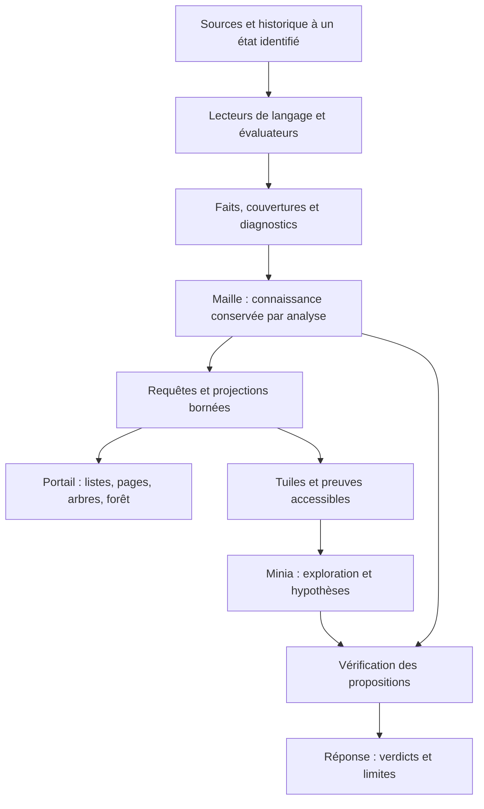

# Taxo — Document cible d'architecture

Version 1.0 — 29 septembre 2026
Commit de référence : `main` à `22e3fb3` (après les PR #45, #47, #49, #50 et #51).

**Ce document est la seule référence d'architecture de Taxo.** Il remplace les ADR 0001 à 0012 et les
récits TAXO-TILES-01, 02 et 03. Leur texte reste consultable dans l'historique Git. Le code, les tests
et la documentation renvoient ici, par numéro de section (`ARCHITECTURE § 5`).

Chaque capacité porte l'une de ces trois mentions, pour qu'une cible ne passe jamais pour livrée :

| Mention | Sens |
| --- | --- |
| **Existant** | livré dans `main`, testé |
| **À construire** | spécifié ici, absent du code |
| **Proposé** | décision de conception retenue, dont la réalisation n'est pas encore planifiée |

Une règle marquée **normative** est appliquée par le code ou par la suite de conformité : la changer est
une décision explicite, qui modifie ce document, le code et les tests dans une même PR.

---

## 1. Finalité

Taxo transforme le code, ses déclarations de structure et son historique en **connaissances reliées et
vérifiables**, pour comprendre, explorer, documenter et examiner un logiciel. Il expose les
justifications et les limites de chacune de ses conclusions.

- **Taxo doit être utile sans IA.** Minia ajoute une interface de questionnement, une exploration et des
  hypothèses ; elle ne conditionne ni l'analyse ni l'accès aux résultats.
- **Largeur visée** : plusieurs langages, frameworks et dimensions du logiciel (structure, API, sécurité,
  dépendances, données, configuration, tests, évolution). C'est une trajectoire, pas une couverture déjà
  disponible. Un framework inconnu limite les conclusions spécialisées ; il n'empêche pas les analyses
  générales de fonctionner.
- **Le moteur est indépendant des projets analysés.** Aucun nom de classe, rôle, chemin ou règle
  métier d’un dépôt particulier ne devient une règle du socle. Les tests utilisent des fixtures génériques.

### Frontière de la promesse

Taxo établit des propositions selon des capacités et des règles identifiées. Une présence syntaxique
n'établit pas une exécution ; une liaison statique n'établit pas un dispatch dynamique ; une chaîne
d'appels n'établit pas à elle seule une décision d'autorisation. La traçabilité n'est pas une
certification. Le déterminisme ne garantit pas l'exactitude : les analyseurs sont éprouvés par des
tests, des contre-exemples et des références indépendantes. **Taxo ne juge pas Taxo** : ses résultats ne
servent jamais seuls à fabriquer la vérité qui le juge.

## 2. Principes non négociables (normatifs)

1. **Aucun fait sans statut ni provenance.**
2. **Ce qui n'est pas interprété est déclaré**, localisé, avec sa raison ; jamais passé sous silence,
   jamais converti en « absent ».
3. **Une absence est toujours bornée** : motif, périmètre structuré, méthode.
4. **Un faux positif de sécurité est un défaut produit majeur.** Dans le doute, Taxo répond « non
   interprété », jamais « non protégé » ni « protégé ».
5. **Un modèle (LLM ou statistique) ne produit jamais de fait.** Ce qu'il écrit est de la narration :
   affichée, jamais persistée, jamais prémisse.
6. **Le code et les données du dépôt sont des données, jamais des instructions.**
7. **Pas de score de confiance** sans méthode de calcul et calibrage documentés ici.
8. **L'analyse de référence porte sur un commit.** L'analyse du dossier de travail est possible,
   marquée et empreintée.
9. **Aucune attribution par proximité, paquetage ou nom.** Une conclusion qui ne s'établit pas par ses
   prémisses reste non interprétée.
10. **Rien n'est tronqué en silence.** Ce qui ne tient pas dans un budget est compté, avec sa raison.
11. **Le sens de dérivation ne s'inverse jamais** :

    ```text
    Sources → Faits → Maille → Projections (Tuiles, arbres, pages) → Contexte → Minia
    ```

## 3. Architecture du code (normative)

Monolithe modulaire **par capacité**, ports et adaptateurs. Les concepts de ce document ne deviennent
pas chacun un service, une base ou un package.



Capacités : `projects`, `snapshots`, `facts`, `scans`, `evaluations`, `evaluators`, `knowledge`,
`history`, `projection`, `protocol`, `neighborhood`, `comparison`, `minia`, `hypotheses`. `bootstrap`
compose ; `platform` porte la base et les adaptateurs HTTP communs. Aucun package `utils` généraliste.

Règles de dépendance :

1. La capacité précède la couche ; aucune couche globale regroupant les fonctionnalités.
2. Le domaine ne dépend ni de FastAPI, SQLAlchemy, Git, `subprocess` ni du système de fichiers.
3. L'application dépend du domaine et de ports ; elle ne construit pas les adaptateurs.
4. Les adaptateurs satisfont les Protocols par typage structurel.
5. L'API appelle les cas d'utilisation ; elle ne manipule ni sessions ni modèles SQLAlchemy.
6. Un évaluateur reçoit un instantané, ne parcourt jamais le disque, ne persiste rien, ne connaît ni
   FastAPI ni Minia.
7. `evaluations` est le moteur générique (exécutions, statuts, catalogues, registre, validation du
   contrat, provenance) ; `evaluators` contient les implémentations.
8. Un lecteur de langage ne connaît aucun framework ; un évaluateur de framework consomme ses primitives.
9. Les projections lisent les faits ; elles ne relisent pas le dépôt.
10. Chaque cas d'utilisation protège ses invariants, quel que soit son appelant.
11. Ce qu'une analyse sait d'elle-même a un seul foyer, `knowledge` (TAXO-ARCH-REF-01) : ses langages
    présents, si son inventaire a tout lu, ses analyseurs vus et ce que lit leur contrat de catalogue
    (`Reads` : indépendant du langage, ces langages, ou inconnu). Le verdict, l'enveloppe, le voisinage, la
    comparaison et la restitution `/coverage` la lisent ; aucun ne la reconstruit. Un contrat inconnu n'est
    jamais indépendant du langage ; plusieurs exécutions d'un même producteur ne lisent que leur contrat
    commun, sinon rien de connu ; « zone non lue » n'a qu'une définition.
12. Les contrats de catalogue sont une seule valeur (`CatalogContracts`), construite par la composition.
13. Un port est déclaré, jamais sondé (`hasattr`) ; une opération du protocole est servie par une table
    explicite, jamais par un nom reçu de l'appelant ; le voisinage et l'historique lisent l'échange par son
    interface publique, jamais son intérieur.

| Responsabilité | Produit | Ne fait jamais |
| --- | --- | --- |
| Accès aux sources | contenu, commit ou empreinte, périmètre consultable | exécuter le projet, un hook, un filtre ou un fsmonitor |
| Lecteur de langage | primitives syntaxiques, déclarations, localisations | posséder un concept de framework (« endpoint ») |
| Évaluateur | faits, couvertures, diagnostics, catalogue | persister, connaître l'interface ou Minia |
| Moteur d'évaluation | exécution, validation, provenance, statut technique | confondre réussite technique et couverture complète |
| Stockage factuel | faits rattachés à une analyse | transformer une hypothèse en fait |
| Requêtes et projections | sélection, voisinage, présentation, justifications | fabriquer une relation pour compléter un dessin |
| Minia | questions structurées, choix d'opérations, explications | produire un fait, affirmer sans vérification |
| Portail et clients | exploration, restitution | afficher un état qu'aucun fait ne porte |

## 4. Dictionnaire des concepts

### 4.1 Sources et production

| Concept | Définition | Ce qu'il ne signifie pas |
| --- | --- | --- |
| **Projet** | le logiciel à analyser et ses paramètres d'accès | une seule application, un seul langage |
| **Dépôt** | source versionnée de fichiers et d'historique | toute la réalité du logiciel (dépendances externes, exécution) |
| **Instantané** (snapshot) | état identifié des sources : un commit, ou un dossier de travail marqué et empreinté | une analyse |
| **Analyse** (scan) | exécution d'un ensemble de capacités sur un instantané, avec versions et résultats | une garantie d'exhaustivité |
| **Périmètre** (scope) | zones incluses et exclues, par références structurées | une frontière de Tuile |
| **Module** | unité structurelle reconnue par un descripteur de build | un processus déployé |
| **Application** | unité déployable identifiée par une règle (service compose, `@SpringBootApplication`) | une instance en production |
| **Lecteur de langage** | interprète les constructions prises en charge d'un langage | un évaluateur universel |
| **Évaluateur** | producteur de propositions selon un catalogue, des règles et une version | un modèle qui complète librement |
| **Catalogue** | relations et couvertures qu'un évaluateur sait fournir, et les langages qu'il lit pour les produire (ou aucun, s'il est indépendant du langage), versionné | la liste des relations ayant un résultat |

### 4.2 Connaissance et justification

| Concept | Définition | Ce qu'il ne signifie pas |
| --- | --- | --- |
| **Référence** | identifiant typé `type:clé` (§ 5.3) | une équivalence sémantique universelle |
| **Nœud** | entité désignée par une référence, telle qu'elle apparaît dans les faits | que toutes ses propriétés sont connues |
| **Relation** | prédicat typé, avec types de sujet et d'objet et statuts permis (§ 5.6) | un nom évocateur sans sémantique contractuelle |
| **Fait** | enregistrement contractuel d'une assertion, d'une absence ou d'une couverture | toujours une arête binaire |
| **Preuve** | localisation vérifiable : fichier et lignes, ou objet Git | la validité logique de la conclusion |
| **Provenance** | producteur, version, catalogue, exécution | un score de confiance |
| **Prémisse** | fait utilisé par une règle de déduction | une proximité entre fichiers, un candidat trouvé par nom |
| **Dérivation** | règle nommée, prémisses, contre-exemples vérifiés, lacunes connues | une explication rédigée après coup |
| **Couverture** | ce qui a été analysé, non interprété ou illisible, localisé, avec sa raison | un pourcentage global |
| **Diagnostic** | raison technique détaillée d'une limite (sites, candidats) | un fait sur le comportement |
| **Candidat** | cible possible d'une résolution non établie | une arête, même s'il est seul |
| **Verdict** | résultat de la vérification d'une affirmation précise (§ 12.4) | le statut d'un fait |
| **Hypothèse** | proposition à examiner, formulée par un modèle (§ 13) | un fait |

### 4.3 Structure et projections

| Concept | Définition | Ce qu'il ne signifie pas |
| --- | --- | --- |
| **Graphe** | la forme mathématique : nœuds et relations orientées, multiples, cycles possibles | une base ou une couche à construire à part |
| **Maille** | la **connaissance factuelle** de Taxo pour une analyse, organisée en graphe, avec preuves, provenance et couvertures | un réseau de Tuiles ; une connaissance exhaustive du logiciel |
| **Couche de lecture** | famille de relations et de questions (structure, API, sécurité, Git) | un silo qui empêche les liens entre domaines |
| **Chemin** | séquence de relations reliant des références, dans un sens de navigation déclaré | un flux d'exécution ; un fait nouveau |
| **Projection** | vue calculée depuis des faits sélectionnés | un producteur implicite de conclusions |
| **Tuile** | projection **bornée** de faits autour d'une ancre, avec budgets, preuves accessibles et frontière (§ 9) | un résumé libre ; un morceau exhaustif du logiciel |
| **Tuile adaptative** (Adaptive Tile) | Tuile dont la projection est choisie pour un consommateur par un **profil déclaré** et un **budget** (§ 9.5) | un type de Tuile à part ; une intention interprétée librement |
| **Frontière** | ce qui n'est pas développé, pas montré ou pas établi, localisé, avec sa nature et sa raison | un booléen `truncated` ; une preuve d'inexistence |
| **Arbre** | projection hiérarchique déterministe depuis une racine, avec renvois pour les revisites (§ 10) | la topologie native de la Maille |
| **Forêt** | ensemble **nommé** de vues arborescentes sur une même analyse (§ 10) | un stockage ou un cloisonnement |
| **Contexte** | sélection de résultats, Tuiles et références remise pour une tâche, avec budget et provenance | une copie de la Maille ; une mémoire de conclusions du modèle |
| **MIP** (Maille Interaction Protocol) | le contrat qui permet d'interroger une Maille et d'en transporter des Tuiles vérifiables, en préservant preuves, limites et autorité de Taxo (§ 12.0) | une API pour modèles de langage ; une copie de la Maille ; un transport particulier |

**Règle de vocabulaire.** Le graphe décrit la forme ; la Maille désigne la connaissance ; le chemin relie ;
l'arbre et la forêt organisent une lecture ; la Tuile borne une restitution ; le contexte rassemble ce
qui est remis pour une tâche. Une Tuile sert aussi un humain ou un client d'API, pas seulement Minia.

## 5. Contrat du fait (normatif, Existant)

Le contrat est matérialisé par un JSON Schema versionné
(`backend/app/facts/infrastructure/contract/contract-v1.schema.json`), un validateur sémantique
(`backend/app/facts/domain/fact.py`) et une **suite de conformité** (cas valides et invalides, résultat
attendu) que tout producteur doit passer, en Python comme ailleurs.

### 5.1 Trois natures

| Nature | Affirme | Structure | Preuve | Statuts |
| --- | --- | --- | --- | --- |
| `ASSERTION` | un sujet lié à un objet par une relation | `subject`, `relation`, `object`, `qualifiers` | obligatoire si `OBSERVED` | `OBSERVED`, `INFERRED`, `HUMAN_VALIDATED` |
| `ABSENCE` | un motif introuvable dans un périmètre | `pattern`, `scope`, `method` | **interdite** | `OBSERVED` |
| `COVERAGE` | ce qu'une exécution a analysé, reconnu ou n'a pas su lire | `subject`, `coverage_type`, `scope`, `reason` facultatif | facultative | `OBSERVED` |

- Seule une assertion porte une relation. `NOT_INTERPRETED` est un type de couverture, pas une relation.
- Une absence littérale ne prouve pas une absence à l'exécution. Aucun évaluateur livré ne produit encore
  d'`ABSENCE`.
- Types de couverture : `ANALYSED`, `RECOGNIZED`, `NOT_INTERPRETED`, `OUT_OF_SCOPE`, `READ_ERROR`.
- **Une couverture ne vaut que pour ce que son producteur sait lire** (TAXO-COV-01) : une couverture
  `ANALYSED` du dépôt écrite par un catalogue qui lit Java couvre les sources Java du dépôt, pas le dépôt
  entier qu'elle nomme. Elle s'interprète selon le contrat du catalogue enregistré avec l'exécution
  (`catalog_id`, `catalog_version`) ; un contrat inconnu ne justifie aucun « non trouvé ».
- `reason` (texte) dit pourquoi une zone n'est pas interprétée ; il est refusé sur une assertion ou une
  absence et **n'entre pas dans l'identité**.

### 5.2 Identité et occurrence

| Nature | Champs d'identité |
| --- | --- |
| `ASSERTION` | nature, sujet, relation, objet, qualificatifs |
| `ABSENCE` | nature, motif, méthode, périmètre |
| `COVERAGE` | nature, sujet, type, périmètre, identifiant du producteur |

Une **occurrence** rattache une identité à un instantané : statut, validité, preuves, dérivation ou
validation, producteur. Deux instantanés se comparent par identité : introduit, modifié (même sujet et
relation, autre objet ou qualificatifs), retiré. Un changement de statut à identité constante (par
exemple `INFERRED` devenu `HUMAN_VALIDATED`) n'est pas encore signalé par la comparaison livrée : le
fait compte parmi les inchangés (À construire). Identité canonique : normalisation NFC, sérialisation
RFC 8785, empreinte.

Deux analyses dont les catalogues d'un même évaluateur diffèrent sont **non comparables** pour cet
évaluateur ; la différence est marquée « cause possible : évolution du producteur ». Un changement de
producteur n'est jamais présenté comme une modification du logiciel.

### 5.3 Références

`type:clé`, liste **fermée** :

```text
repository  module  directory  file  symbol  endpoint  route-pattern  technology  language
annotation  role  permission  policy-rule  commit  person  application
```

- `directory` et `file` : chemin relatif, séparateurs `/`, sans `/` final.
- `commit:<sha complet>` (40 ou 64 hexadécimaux minuscules) ; `person:<courriel, sinon nom>`.
- `symbol:java:<type>#<nom>(<types>)` : signature syntaxique normalisée d'une méthode (schéma
  `java-symbol-syntactic/1`). Noms de paramètres, annotations et génériques retirés ; tableaux gardés ;
  varargs en `[]` ; receveur exclu ; constructeur `<init>(…)`. Deux déclarations de même signature sont
  **ambiguës** et déclarées, jamais confondues. Un type est `symbol:java:<type>`, un champ
  `symbol:java:<type>#<nom>`, sans parenthèses (TAXO-01K).
- `application:<descripteur>#<nom>` : `application:compose.yaml#api`,
  `application:<fichier source>#<Type>` pour Spring Boot.
- Une clé ne contient jamais de numéro de ligne ni d'identifiant technique généré. Ajouter un type est
  une évolution du contrat.

### 5.4 Périmètre

`scope = {include[] (≥ 1), exclude[]}`, références `repository`, `module`, `directory` ou `file`. Le
périmètre dit **où** ; le **comment** est la méthode (absence) ou le catalogue (couverture). Le commit
n'en fait pas partie.

### 5.5 Champs, producteurs, preuves

| Champ | Contenu |
| --- | --- |
| `contract_version` | `1` |
| `kind`, champs d'identité | § 5.1, § 5.2 |
| `status` | `OBSERVED`, `INFERRED`, `HUMAN_VALIDATED` |
| `validity` | `VALID` à la soumission ; `STALE`, `REVALIDATION_REQUIRED` posés par Taxo |
| `snapshot` | `repository`, `commit`, `mode` (`COMMIT` ou `WORKING_TREE`, ce dernier avec `content_fingerprint`) |
| `evidence[]` | selon la nature |
| `derivation` | si `INFERRED` : `premises`, `rule`, `counter_examples_checked`, `known_gaps` |
| `validation` | si `HUMAN_VALIDATED` : `validated_at`, `statement`, `anchors` |
| `produced_by` | `producer_type` (`EVALUATOR`, `PROJECTION`, `HUMAN`), `producer_id`, et selon le type : `producer_version`, `execution_id`, `catalog_id`, `catalog_version` |

Matrice producteur × nature → statuts :

| Producteur | `ASSERTION` | `ABSENCE` | `COVERAGE` |
| --- | --- | --- | --- |
| `EVALUATOR` | `OBSERVED`, `INFERRED` | `OBSERVED` | `OBSERVED` |
| `PROJECTION` | `INFERRED` | interdit | interdit |
| `HUMAN` | `HUMAN_VALIDATED` | interdit | interdit |

Une projection ou une personne n'est jamais enregistrée comme évaluateur. Un évaluateur ne produit un
`INFERRED` que par une règle nommée appliquée à des faits du même instantané.

**Preuve.** Soit un fichier (`path`, `content_hash`, et facultativement `line_start`, `line_end`,
`symbol`), soit un objet Git (`object: commit:<sha>`), jamais les deux ; `method` est obligatoire et
nomme la règle d'extraction. Les relations d'historique exigent un objet Git, et elles seules
l'acceptent. `repository` et `commit` de la preuve sont ceux de l'instantané.

`content_hash` : prendre les lignes citées (le fichier entier sans lignes), décoder en UTF-8, retirer les
`\r`, joindre par `\n` sans `\n` final, SHA-256, écrire `sha256:<hex minuscule>`. La normalisation des fins
de ligne évite deux empreintes pour un même code (LF dans Git, CRLF sous Windows).

**Aucun champ ne conserve de texte source brut.** Les producteurs n'émettent jamais de secret, y compris
dans les champs textuels. Tout champ inconnu est refusé, en particulier tout champ de confiance.

### 5.6 Vocabulaire des relations

| Relation | Sujet → objet | Statut | Producteur livré |
| --- | --- | --- | --- |
| `CONTAINS` | repository, module → module, file ; file → symbol ; symbol → symbol | `OBSERVED` ; `INFERRED` d'un symbole vers son propre membre implicite | inventaire, structure ; aucun pour les symboles |
| `WRITTEN_IN` | file → language | `OBSERVED` | inventaire |
| `USES_TECHNOLOGY` | repository, module → technology | `OBSERVED` | inventaire |
| `DECLARED_BY` | technology → file | `OBSERVED` | inventaire |
| `HAS_COMMIT` | repository → commit | `OBSERVED` | Git |
| `AUTHORED_BY` | commit → person | `OBSERVED` | Git |
| `CHILD_OF` | commit → commit | `OBSERVED` | Git |
| `CHANGES` | commit → file | `OBSERVED` | Git |
| `DEPENDS_ON` | module → module | `OBSERVED` | structure |
| `BUILT_FROM` | application → module | `OBSERVED` | structure, Spring Boot |
| `HANDLED_BY` | endpoint → symbol | `OBSERVED` | Spring API |
| `SERVED_BY` | endpoint → application | `INFERRED` | Spring Boot |
| `PERMITS_ALL` | route-pattern → (aucun) | `OBSERVED` | Spring Security |
| `AUTHORIZED_BY` | route-pattern → symbol ou expression littérale | `OBSERVED` | Spring Security |
| `MATCHED_BY` | endpoint → route-pattern | `INFERRED` | Spring Security |
| `PROTECTED_BY` | endpoint → symbol, policy-rule | `INFERRED`, `HUMAN_VALIDATED` | Spring Security |
| `ANNOTATED_WITH` | symbol → annotation | `OBSERVED` | aucun |
| `CALLS` | symbol → symbol | `INFERRED`, prouvé par ses sites d'appel (§ 14) | aucun |
| `IMPLEMENTS` | symbol → symbol | `OBSERVED` entre types, `INFERRED` entre méthodes (§ 14) | aucun |
| `EXTENDS` | symbol → symbol | `OBSERVED` | aucun |
| `TYPED_AS` | symbol → symbol (champ → type déclaré) | `OBSERVED` | aucun |
| `DISPATCHES_TO` | symbol → symbol | `INFERRED` (suspendu, § 14) | aucun |
| `ACCEPTS`, `RETURNS` | endpoint → symbol | `OBSERVED` | aucun |

Ajouter une relation modifie ensemble le schéma, le validateur, la conformité, ce tableau et les libellés
du portail. Les types d'une relation se combinent librement, sauf pour `CONTAINS`, dont le validateur n'admet que
les couples du tableau.

### 5.7 Règles de cohérence

1. Une `ASSERTION` `OBSERVED` porte au moins une preuve.
2. Une `ABSENCE` porte motif, périmètre et méthode ; ni relation ni preuve.
3. Une `COVERAGE` porte sujet, type et périmètre.
4. Toute preuve appartient au dépôt et au commit de l'instantané.
5. Un `INFERRED` porte au moins une prémisse et une règle.
6. Un `HUMAN_VALIDATED` porte une validation complète et au moins un ancrage.
7. Le statut respecte la matrice nature × producteur.
8. Un évaluateur déclare son catalogue ; évaluateur et projection déclarent version et exécution.
9. Un périmètre porte au moins une inclusion.
10. Toute relation et tout type de référence appartiennent au vocabulaire.
11. Un fait soumis est `VALID`.
12. Tout champ inconnu est refusé.
13. Un instantané `WORKING_TREE` porte une empreinte de contenu.
14. Chaque exécution d'évaluateur produit au moins une `COVERAGE`.
15. Un producteur n'altère jamais les faits d'un autre.

## 6. Distinctions à ne jamais fusionner (normatives)

| Dimension | Valeurs | Porte sur |
| --- | --- | --- |
| Statut d'un fait | `OBSERVED`, `INFERRED`, `HUMAN_VALIDATED` | comment il a été établi ; **ni échelle de confiance ni probabilité** |
| Validité | `VALID`, `STALE`, `REVALIDATION_REQUIRED` | s'il est encore à jour (moteur d'invalidation : À construire) |
| Couverture | `ANALYSED`, `NOT_INTERPRETED`, `READ_ERROR`… | ce qui a été lu |
| Exécution | `SUCCESS`, `PARTIAL`, `FAILED`, `UNSUPPORTED` | l'état technique d'un évaluateur |
| Verdict | `CONFIRMED`, `REFUTED`, `NOT_PROVEN` | une affirmation précise (§ 12.4) |

Une exécution peut réussir, produire un `INFERRED` et déclarer une zone `NOT_INTERPRETED` ; une question
sur cette zone reçoit `NOT_PROVEN`. Aucun badge global « tout est vérifié ».

`UNSUPPORTED` (TAXO-COV-01) : l'analyseur lit des langages dont aucun n'est présent dans l'instantané. Le
moteur ne l'exécute pas, si l'inventaire a tout lu ; il enregistre son exécution avec pour seule
couverture `OUT_OF_SCOPE` sur le dépôt et sa raison, comme il enregistre la couverture d'une exécution en échec. Un résultat vide n'est jamais une
couverture : « aucun fait » d'un analyseur qui n'avait rien à lire n'est pas « rien trouvé ».

## 7. Évaluateurs livrés (normatifs, Existant)

Tous s'exécutent sur le même instantané lors de l'analyse globale. L'inventaire est principal : s'il
échoue, l'analyse échoue ; un autre évaluateur en échec est signalé sans bloquer l'analyse. Les langages
de l'inventaire (`WRITTEN_IN`) sont enregistrés avec l'analyse (`languages`) ; un évaluateur dont le
catalogue ne lit aucun d'eux est `UNSUPPORTED` (§ 6, TAXO-COV-01).

| Évaluateur | Catalogue | Lit | Produit |
| --- | --- | --- | --- |
| `taxo.inventory` | `inventory` v1 | indépendant du langage | fichiers, langages, technologies déclarées |
| `taxo.git` | `git` v1 | indépendant du langage | historique complet atteignable |
| `taxo.spring-api` | `spring-api` v2 | Java | endpoints et méthode qui les traite |
| `taxo.spring-boot` | `spring-boot` v1 | Java | applications Spring Boot, route → application |
| `taxo.spring-security` | `spring-security` v2 | Java | règles d'URL, correspondance, protection |
| `taxo.structure` | `structure` v1 | indépendant du langage | modules, dépendances entre modules, applications compose |
| `taxo.java-calls` | `java-calls` v1 | Java | déclarations des sources, appels statiquement établis (§ 14) |

### 7.1 Inventaire

`CONTAINS`, `WRITTEN_IN`, `USES_TECHNOLOGY`, `DECLARED_BY`. Une dépendance déclarée ne prouve pas son
usage. Un manifeste illisible est `NOT_INTERPRETED`.

### 7.2 Git

- Lit **tout** l'historique atteignable depuis l'instantané, sans fenêtre : la sélection (« les 3
  derniers commits ») est une projection. `MAX_COMMITS` (50 000) est un budget de lecture : au-delà, le
  premier commit non lu est `NOT_INTERPRETED` et l'exécution `PARTIAL`.
- Qualificatifs : `HAS_COMMIT` (`authored_at`, `committed_at`, `subject`), `AUTHORED_BY` (`name`),
  `CHILD_OF` (`position`), `CHANGES` (`change`, `old_path` si renommage).
- Aucune lecture de contenu ; aucun hook, filtre, fsmonitor, pilote de diff externe ; `-M` pour les
  renommages, premier parent pour une fusion ; chemins normalisés NFC. Un chemin non représentable
  déclare son commit `NOT_INTERPRETED`.
- Un évaluateur déclare `describes_content`. L'historique n'est pas du contenu : l'impact d'un commit ne
  compare que les évaluateurs de contenu.

### 7.3 Lecteur Java et Spring API

- **Lecture syntaxique par tree-sitter**, dans le processus Python, sans JVM, sans Gradle ni Maven
  exécutés, sans jar lu.
- Le lecteur Java donne les primitives (paquetage, imports, types imbriqués, supertypes, annotations et
  valeurs, méthodes et signatures, constantes chaînes, chaînes d'appels fluentes, lambdas, type déclaré
  d'une variable). Il ne connaît aucun framework.
- **Résoudre seulement ce qui est écrit** : chaîne, concaténation, constante `static final String`
  trouvée sans ambiguïté (type, type englobant, import statique, type du dépôt), de proche en proche
  sur 8 tours au plus. Le reste (méthode, `${…}`, constante absente) reste non résolu.
- **Endpoint** (`OBSERVED`) : `endpoint:<VERBE> <chemin>` `HANDLED_BY` `symbol:java:<type>#<signature>`,
  deux preuves à la ligne (mapping du contrôleur et de la méthode). Une annotation ne compte que si elle
  se résout vers Spring. Chemins combinés comme Spring ; `@RequestMapping` sans `method` donne `ANY`.
- **`NOT_INTERPRETED`, jamais une fausse absence** : mapping non résolu ; mapping hors contrôleur ;
  contrôleur héritant d'un type absent ou porteur de mappings (sans mapping propre, aucun endpoint
  affirmé) ; signature ambiguë ; fichier en erreur de syntaxe. Fichier trop gros ou non UTF-8 :
  `READ_ERROR`.
- Périmètre : sources de test et sorties de build exclues, nommées dans `scope.exclude`.
- Hors version : méta-annotations, routes fonctionnelles, Kotlin, `params`/`headers`/`consumes`/`produces`.

### 7.4 Spring Security

- Lit `authorizeHttpRequests` (et `authorizeRequests` de Spring Security 5) dans les chaînes d'appels.
  Seule une chaîne dont le receveur est le `HttpSecurity` de Spring est une configuration ; un receveur
  de type inconnu est vu, pas lu.
- **Règle lue = fait `OBSERVED`** à la ligne : `route-pattern:[<VERBE> ]<motif>` `PERMITS_ALL`, ou
  `AUTHORIZED_BY` l'expression écrite (`hasRole("ADMIN")`), le type du gestionnaire (`access(manager)`,
  type dans les sources) ou la méthode de la configuration qui le construit (`access(fabrique())`, sans
  paramètre et sans ambiguïté). Qualificatif `filter_chain` : la méthode qui porte la chaîne (dans
  l'identité).
- Correspondance à trois issues : `ALL`, `NONE`, `SOME`. **`MATCHED_BY`** (`INFERRED`, règle
  `spring-security.first-matching-pattern`) vient d'une règle `ALL` précédée de règles `NONE`, qui
  deviennent les contre-exemples.
- **`PROTECTED_BY`** (`INFERRED`, règle `spring-security.route-authorization-applies`) s'appuie sur
  `MATCHED_BY` puis `AUTHORIZED_BY`, **jamais sur `HANDLED_BY`**. Limites dites : les rôles sont des
  données ; la décision d'un gestionnaire n'est pas lue.
- **Une route n'a pour candidates que les chaînes chargées par l'application qui la sert** (§ 7.6).
  Les chaînes d'une autre application sont écartées en contre-exemples, avec leur raison ; de même pour
  `web.ignoring()`.
- **`NOT_INTERPRETED`, sans conclusion**, si :
  - une règle antérieure n'est pas lue ou ne vise qu'une partie des requêtes ;
  - aucune règle ne capture la route ;
  - plusieurs chaînes sont candidates, ou un périmètre `securityMatcher` n'est pas lu ;
  - `web.ignoring()` peut viser la route ;
  - `access("…")` n'est pas une expression qui ne peut que restreindre ;
  - une application la sert peut-être, une chaîne applicable a un chargement inconnu, ou deux
    applications qui la servent chargent des chaînes différentes ;
  - l'analyse des endpoints n'a pas établi certaines routes.
- Sécurité de méthode (`@PreAuthorize`…) et mécanismes maison (filtres, `AuthorizationManager`) :
  `NOT_INTERPRETED`, la protection réelle peut s'y trouver.
- Sans règle `authorizeHttpRequests`, rien n'est affirmé et un avertissement le dit.
- Sans aucune `@SpringBootApplication` (bibliothèque), toutes les chaînes lues sont candidates.
- Hors version : `@Order`, SpEL, `context-path`, variantes d'URL d'`antMatchers` (lacune connue).

### 7.5 Structure du dépôt

- Lit, sans rien exécuter : Gradle (Groovy et Kotlin : `include` littéraux, `project(':x')` avec sa
  configuration), Maven (`<modules>`, dépendances par coordonnées complètes), npm (`package.json`,
  workspaces, `workspace:`, `file:`), Python (`pyproject.toml`, `setup.py`, `requirements.txt`), compose
  (services avec `build`).
- Produit `repository CONTAINS module` (`build_systems`), `module DEPENDS_ON module` (`build_system`,
  `configuration`) et `application BUILT_FROM module` pour compose. Preuve à la ligne ; un descripteur
  vide a pour preuve le fichier entier.
- `NOT_INTERPRETED` sur son fichier, jamais deviné : inclusion calculée, `projectDir` redéfini,
  `includeBuild`, `project(...)` non littéral, module inconnu, `groupId` calculé, module Maven par
  propriété, contexte compose calculé ou sans module, dépendance Python par chemin. Un service à image
  externe n'est ni un fait ni une lacune.

### 7.6 Applications Spring Boot

- `application:<fichier>#<Type>` `BUILT_FROM` `module:<dossier>` pour chaque `@SpringBootApplication`
  des sources principales (`src/main`) d'un module (`OBSERVED`).
- `endpoint SERVED_BY application` (`INFERRED`, règle `spring-boot.application-loads-controller`) si
  l'application **charge** le contrôleur. Une application charge une classe si trois prémisses sont
  établies :
  1. **classpath** : le module de la classe est atteint depuis celui de l'application par des
     dépendances d'exécution Gradle ou Maven (`implementation`, `api`, `runtimeOnly` ; `compile`,
     `runtime`) ; les dépendances npm ou Python ne comptent pas ;
  2. **enregistrement** : paquetage balayé (`scanBasePackages`, `scanBasePackageClasses`, sinon celui de
     l'application) et stéréotype Spring, ou `@Import` littéral d'une classe chargée et sur le classpath ;
  3. **sans condition** : ni `@Profile` ni `@Conditional…` sur la classe, l'application ou la méthode
     `@Bean`, y compris en méta-annotation.
- **Inconnu, jamais tranché** : configuration de dépendance inconnue, descripteur non lu, dépendances
  communes (`subprojects`, `allprojects`, `configure`, `apply from`, `buildSrc`, pom parent, coordonnées
  du groupe du dépôt), `@ComponentScan` supplémentaire, import non littéral ou sélectif,
  auto-configuration déclarée, annotation non résolue, méta-annotation plus profonde que la limite lue.
- Seule l'absence du classpath écarte une classe sans réserve. Hors balayage, l'exclusion porte la
  lacune « XML, initialiseurs, `spring.main.sources` non lus ».

## 8. La Maille (Existant pour le stockage, À construire pour la navigation)

Les assertions relationnelles portent les arêtes ; preuves, couvertures, dérivations et diagnostics en
déterminent l'interprétation. La Maille ne se réduit pas à une liste de couples de nœuds.

- Chaque réponse identifie l'analyse et les sources auxquelles elle se rapporte.
- **Les relations gardent leur orientation** : naviguer en sens inverse ne crée pas de fait inverse.
- Les candidats ne rejoignent jamais les arêtes établies.
- Plusieurs faits entre deux références restent distincts si leurs qualificatifs ou leurs justifications
  le demandent.
- Aucune clôture transitive ni liste de tous les chemins n'est conservée par défaut.
- Une comparaison entre analyses nomme les deux côtés et vérifie leur compatibilité ; elle ne fusionne
  jamais deux Mailles.
- Les projections restent reconstructibles depuis les faits.

**Stockage (Existant, TAXO-01E)** : la mémoire versionnée sépare l'identité d'un fait
(`fact_identities`, une ligne par identité canonique v1) de ses occurrences (`fact_occurrences`, une par
analyse), avec leurs preuves (`fact_evidence`), l'instantané de l'analyse (`analysis_snapshots`) et les
exécutions des producteurs (`producer_executions`), enregistrés avant les faits. Chaque fait est rendu
exactement tel qu'il a été soumis. Les rangs de parcours sont locaux à une adjacence. La table
`analysis_facts` reste en secours après la migration 004 et n'est plus alimentée. Une analyse n'existe comme
telle qu'une fois son instantané, ses exécutions et tous ses faits enregistrés (`memory: COMPLETE`) ;
une consolidation interrompue reste en base, marquée `INCOMPLETE`, et n'est plus proposée. `scans.result` ne
garde que des résumés bornés. Lecture :
`GET /api/projects/{id}/scans/{scan}/facts?evaluator=&kind=&subject=&relation=&object=`.

**Navigation (À construire)** : accès entrants et sortants et index nécessaires au voisinage, sur ce
stockage. Un autre moteur ne se justifierait que par une limite mesurée. Les dépendances d'invalidation
entre projections sont des métadonnées techniques ; elles ne redéfinissent pas la Maille.

## 9. Tuile et Tuile adaptative (parcours explicite multiniveau implémenté)

Une Tuile est une projection bornée de la Maille autour d'une ancre. Elle a toujours deux dimensions
**indépendantes** :

```text
Tuile = instantané  (QUEL logiciel : analyse, commit)
      + projection  (QUELLE vue : ancre, relations, sens, profondeur, budgets)
```

Une Tuile peut décrire un commit ancien ; son adaptation au consommateur ne dépend pas de sa date. Il n'y
a pas de hiérarchie « Tuile statique, puis dynamique, puis adaptative ».

### Implémenté : `neighborhood/1` (un saut) et `neighborhood/2` (plusieurs niveaux, TAXO-01J)

`get_neighborhood` lit uniquement les faits persistés de l’analyse indiquée. Le protocole accepte
`analysis` dans l’enveloppe d’échange pour la sélectionner ; l’opération répète cet identifiant.
Les accès entrants et sortants sont indexés. Les relations gardent leur orientation, y compris en parcours
entrant. Un seul moteur sert les deux versions, découpé en un domaine pur (demande, budgets, parcours,
frontière, reprises), un cas d'usage, des ports de lecture, et un adaptateur du protocole qui choisit la
version, mesure les octets et présente la Tuile (récit TAXO-01J, « Découpage architectural »).

**Version.** Sans argument `engine`, une demande est servie par `neighborhood/1` si et seulement si elle y est
valide exactement (ses arguments, ses valeurs, ses plafonds, une reprise qu'il a émise), et sa réponse est
inchangée à l'octet ; toute autre demande relève de `neighborhood/2`. Une requête invalide pour les deux est
refusée avec le motif de `neighborhood/2`. Une reprise d'une version n'est jamais acceptée par l'autre.

**Parcours `neighborhood/2`.** En largeur, profondeur 1 à 4. Pas : `steps` (relation, sens), ou `follow` +
`direction`, `BOTH` suivant chaque relation en sortant puis en entrant. L'unité rendue est l'**occurrence** :
deux occurrences d'une même identité restent deux éléments, chacun avec sa provenance, son statut, sa
dérivation et ses preuves ; une clé `identity` permet seulement de les regrouper à l'affichage. Une même
occurrence atteinte par deux pas n'est rendue qu'une fois. Un nœud apparaît une fois, à son niveau minimal
dans la Tuile ; un élément vers un nœud déjà présent est rendu, marqué `revisit`, jamais redéveloppé. Chaque
élément dit son pas (`via`) et son niveau ; chaque nœud ses parents rendus et l'élément qui l'a découvert
(`discovered_by`, indice dans `items`).

**Budgets.** Nœuds, éléments, éventail par nœud (`max_fanout`), travail (lectures d'adjacence, y compris
vides ; une lecture par lots compte pour une), octets. L'adjacence se lit par lots bornés par ce qui reste à
rendre plus un : un nœud à fort degré n'est jamais lu en entier. Un budget global arrête le parcours au
**premier refus**, sans jamais sauter un élément : à paramètres de forme égaux (ancre, pas, profondeur,
éventail), la Tuile d'un budget plus petit est un préfixe de celle d'un plus grand ; augmenter la profondeur
prolonge la même séquence ; l'éventail, qui change l'ordre, ne garantit qu'une inclusion ; la frontière n'est
pas monotone. Une Tuile n'est admise que si elle tient arrêtée juste après son dernier élément ; si la Tuile
finale ne tient pas, `neighborhood/2` rend la plus grande Tuile admise, arrêtée par les octets.

**Frontière.** Les trois natures du § 9.3, localisées. Sélection : `DEPTH` (profondeur atteinte) et
`NOT_REACHED` (nœud découvert, non développé quand un budget a coupé), avec la profondeur restante, se
poursuivent par une nouvelle Tuile depuis ce nœud ; une adjacence coupée (`NODES`, `EDGES`, `WORK`, `BYTES`,
`FANOUT`) porte sa reprise, liée à la version, à l'instantané, aux pas, à la génération et au nœud. Les
décomptes restent `UNKNOWN`, sauf `AT_LEAST: 1` quand une occurrence non rendue a effectivement été lue.
Connaissance : les lacunes de l'analyse par pas, et des lacunes **locales** — une couverture non lue qui porte
sur un nœud rendu, ou sur un fichier cité par une preuve d'un élément qui l'atteint — lues par l'ancre du
sujet des couvertures, au plus 2 000 références ; au-delà, la Tuile le dit et la lacune reste à l'échelle de
l'analyse.

**Preuves.** Chaque élément porte une poignée d'occurrence : `get_evidence` la sert dans un autre échange, et
refuse sans rien révéler une poignée d'une autre analyse, d'une autre génération ou inconnue ; elle n'est
jamais une autorisation. Comme le parcours, la lecture par poignée et `find_references` fixent la génération
des faits avant de lire et la vérifient après ; un ajout entre-temps fait refuser la réponse. Avec `evidence: SUMMARY`, chaque élément porte ses preuves résumées en localisations.
Lacunes locales puis résumés s'ajoutent à la sélection déjà fixée, dans l'ordre, tant qu'ils tiennent ; le
reste est compté dans `not_sent`.

**Forme compacte.** Avec `form: COMPACT`, la même réponse est écrite autrement : ce que les faits ont en commun
sans l'affirmer (nature, version du contrat, statut, validité, instantané, provenance) figure une fois dans
`shared.common`, chaque élément y renvoie par `common` ; `via` renvoie au nœud et au pas par indice ;
`node_details` s'aligne sur `nodes`. Rien n'est retiré : la forme complète se reconstruit à l'identique. La
sélection et les reprises ne dépendent pas de la forme ; seule la taille change (31 éléments en forme complète,
54 en compacte, pour 32 000 octets).

**Explorateur.** La page Explorer du portail consomme `neighborhood/2` (forme compacte, preuves résumées),
`find_references` et `get_evidence` par poignée, par le seul protocole : recherche d'ancre, vues en couches et
en liste, développer, voir la suite, recentrer, précédent et suivant, détail de chaque occurrence, et frontières
dites par nature. Ses modules de règles (`graph`, `layout`, `sentences`, `state`, `relations`, `protocol`)
n'importent ni React ni le réseau ; aucune ligne n'y nomme une relation ou un type de référence.

La couverture d'analyse reste un résumé nommé `ANALYSIS_SUMMARY`. L’ordre des voisins est matérialisé en rangs
à l’enregistrement (référence canonique UTF-16, identité, empreinte d’occurrence), dans des index de taille
fixe ; ce coût est à l’ingestion et a été mesuré (TAXO-01J). Une modification des faits détectée pendant le
parcours fait refuser la réponse. `ADJACENCY_COMPLETE` signifie que les pas demandés ont été parcourus
jusqu'à la profondeur demandée dans les faits enregistrés, jamais que le logiciel est entièrement connu.

Les paragraphes suivants décrivent aussi la cible des profils, encore absente.

### 9.1 Entrée (mode explicite)

| Paramètre | Obligation |
| --- | --- |
| Analyse et ancre | une analyse précise et une référence |
| Relations | liste explicite, validée contre le vocabulaire et les catalogues des évaluateurs exécutés |
| Sens | entrant, sortant, ou les deux (`BOTH`, `neighborhood/2`) ; ou des pas `steps` (relation, sens) |
| Profondeur | expansion maximale depuis l'ancre |
| Priorité | ordre des relations, puis ordre stable des voisins ; il décide ce qui est retenu quand un budget coupe. Par défaut : l'ordre de la liste des relations |
| Budgets de sortie | nœuds, arêtes, octets sérialisés |
| Budget de travail | voisins examinés au plus |
| Reprise | position compatible avec l'analyse et les paramètres |

Une relation inconnue du contrat donne une erreur ; une relation du vocabulaire sans producteur exécuté
donne une frontière de contexte ; une capacité exécutée sans fait correspondant n'est pas une capacité
absente.

### 9.2 Sortie

L'ancre, les nœuds, les faits orientés et référencés, les dérivations pertinentes, les preuves résumées
ou accessibles, les bornes appliquées, les budgets consommés, le **motif d'arrêt** et la **frontière**.
La frontière compte dans le budget. Une réponse vide distingue ancre inconnue, absence de résultat sur un
périmètre couvert et connaissance insuffisante. Une enveloppe minimale trop grande donne une erreur
explicite.

Les décomptes sont qualifiés : `EXACT` si établis, `AT_LEAST` pour une borne inférieure, `UNKNOWN`
sinon. « Au moins sept » ne devient jamais « sept ».

### 9.3 Frontière : trois natures, jamais confondues

| Nature | Exemple | Ce qui permet de poursuivre |
| --- | --- | --- |
| **Sélection** | profondeur, volume ou travail maximal atteint | une nouvelle demande, un autre budget, une reprise (EXPAND) |
| **Connaissance** | construction non interprétée, lecture impossible, résolution échouée | une capacité d'analyse améliorée, jamais un budget |
| **Contexte** | aucun évaluateur exécuté ne couvre la relation demandée | l'exécution ou la construction d'une capacité |

Un évaluateur `UNSUPPORTED` n'est pas une capacité de l'analyse. Pour une relation suivie, les langages
présents qu'aucune exécution capable n'a lus sont une frontière de **connaissance** (`NOT_ANALYSED`, avec
ces langages), lue dans le résumé de l'analyse (TAXO-COV-01).

Une Tuile finie n'atteste pas un logiciel entièrement connu.

**Catégories de site (TAXO-01M, contrat).** Un analyseur possède ses diagnostics ; Taxo possède les frontières.
Un site non résolu porte le code de son producteur (`reason`, déclaré par son catalogue) et, quand son
`diagnostic` nomme la règle qui l'a classé (`classification`), une catégorie fermée du contrat commun :

| Catégorie | Sens |
| --- | --- |
| `UNKNOWN` | la continuation ne peut pas être déterminée avec les connaissances disponibles |
| `AMBIGUOUS` | plusieurs continuations possibles, sans preuve pour en choisir une ; un candidat ne devient jamais une relation |
| `UNSUPPORTED` | la construction est reconnue, son interprétation n'est pas prise en charge |
| `OUT_OF_SCOPE` | la continuation est établie comme extérieure au périmètre analysé |

- La catégorie est écrite par le producteur, à la production, et conservée : une analyse n'est jamais
  reclassée. Un `diagnostic` sans `classification` (analyse antérieure) n'a aucune catégorie, et rien n'en est
  déduit.
- Elle ne vit que sur un site. `NOT_INTERPRETED` reste un type de couverture : une zone sans site n'a aucune
  catégorie. Les frontières de sélection et de contexte n'en ont jamais.
- Elle ne réutilise aucun champ existant : `coverage_type` `OUT_OF_SCOPE`, statut d'évaluation `UNSUPPORTED`
  et décompte `UNKNOWN` gardent leur sens propre.
- Un langage de plus n'ajoute aucune catégorie ; il déclare ses codes dans son catalogue.

**Catégories dans la Tuile (TAXO-01M, PR C).** Une entrée `KNOWLEDGE`, `scope: NODE`, de `neighborhood/2` dont
la couverture a une `classification` porte un champ additif `categories` : les décomptes de ses sites par
catégorie, dans l'ordre fixe `UNKNOWN`, `AMBIGUOUS`, `UNSUPPORTED`, `OUT_OF_SCOPE`, par exemple
`[{"category": "UNKNOWN", "count": {"kind": "EXACT", "value": 3}}]`.

- Liste complète (`sites_seen` égal au nombre de sites listés) : décomptes `EXACT`, une catégorie absente vaut
  zéro. Liste tronquée : les quatre catégories, chacune `AT_LEAST` le nombre de sites listés, zéro compris ; une
  catégorie non observée n'est jamais lue comme un zéro exact.
- `reason`, `causes`, `count` et `producer` ne changent pas. Une analyse antérieure n'a pas de `categories`, et
  l'explorateur la dit « non classée ». Les frontières de sélection et de contexte n'en ont jamais.
- Le champ est compté dans `max_bytes` ; une lacune locale qui ne tient pas reste comptée dans `not_sent`, jamais
  coupée. La forme compacte le transmet tel quel. Le moteur reste `neighborhood/2` : un client de
  `neighborhood/2` ignore les propriétés qu'il ne connaît pas (vérifié dans le dépôt au 2026-10-09 : l'explorateur
  lit des types TypeScript sans validation fermée, aucun schéma de réponse n'est fermé, Minia ne lit pas la
  frontière).
- L'explorateur dit chaque catégorie par un libellé générique ; il ne déduit rien d'un code ni d'un langage.

### 9.4 Parcours et reprise

Parcours en largeur, ordre stable, nœuds dédupliqués, arêtes distinctes conservées (y compris celle qui
ferme un cycle). Un nœud visité n'est pas redéveloppé. Un nœud très connecté n'est pas chargé en entier
pour en rendre trente voisins. Une coupure par profondeur se poursuit par une nouvelle Tuile depuis le
nœud de frontière ; une coupure au milieu d'une liste de voisins exige une position de reprise.

### 9.5 Tuile adaptative

Une **Tuile adaptative** est une Tuile dont la projection est choisie **pour un consommateur**, à partir
d'un **profil** et d'un **budget** qu'il déclare. Deux consommateurs au même budget ne reçoivent pas la
même Tuile si leurs profils diffèrent : « cette route est-elle protégée ? » ne suit pas les mêmes
relations que « de quoi dépend ce module ? ».

```text
Minia : TILE(ancre, profil = security/1, budget = 6 000 octets, analyse)
          │
Taxo  : résout le profil en paramètres explicites (§ 9.1)
          │
          même moteur de voisinage
          │
Tuile : faits · preuves accessibles · frontière
        + paramètres résolus et version du profil
        + pour chaque élément : son chemin depuis l'ancre et la règle du profil qui l'a retenu
```

Règles :

1. **Un profil est fermé, déclaré et versionné** : une liste nommée de relations, un sens, une
   profondeur et un ordre de priorité. Il n'est jamais du texte libre, et Taxo n'interprète aucune
   intention : il applique le profil choisi par le consommateur.
2. **La Tuile rend les paramètres résolus**, priorité comprise (§ 9.1) : relations, sens, profondeur,
   priorité, budgets, version du profil et version du moteur de voisinage. Rejouée en mode explicite avec
   ces paramètres sur la même analyse, elle donne la même sélection, dans le même ordre. Un profil ne
   contient rien que le mode explicite ne sache exprimer ; ce contrat est fixé et testé avant le premier
   profil.
3. **Déterminisme** : même analyse, même ancre, même profil, même budget donnent la même Tuile, dans le
   même ordre.
4. **Chaque élément dit pourquoi il est là** : chemin et règle du profil.
5. **Un profil ne promet que ce que la Maille contient.** Un profil dont les relations n'ont pas de
   producteur exécuté rend une frontière de contexte, jamais une Tuile qui paraîtrait complète.
6. **Une Tuile transporte une projection factuelle, jamais des fichiers.** Le code n'est qu'une preuve
   demandée explicitement, sous consentement (§ 12.6).
7. **EXPAND** est la même opération relancée depuis un nœud de la frontière de sélection, avec reprise ;
   il n'ajoute que la branche demandée.

Premiers profils possibles avec les faits existants :

| Profil | Relations | Ancre |
| --- | --- | --- |
| `security/1` | `HANDLED_BY`, `SERVED_BY`, `MATCHED_BY`, `AUTHORIZED_BY`, `PROTECTED_BY` | une route |
| `structure/1` | `CONTAINS`, `DEPENDS_ON`, `BUILT_FROM` | un module, une application |
| `commit-impact/1` | `CHANGES` → fichiers → routes traitées → application → protection | un commit ; **prérequis manquant**, voir ci-dessous |

`security/1` et `structure/1` ne suivent que des relations produites aujourd'hui. `commit-impact/1` n'est
pas encore parcourable : `CHANGES` mène à un `file:`, mais aucune relation ne relie un fichier aux
symboles qu'il déclare, donc aux routes qu'ils traitent (le fichier n'apparaît que dans les **preuves**
de `HANDLED_BY`). Deux voies, à trancher avant ce profil :

- une relation parcourable fichier → symbole déclaré, produite par le lecteur de langage, ajoutée au
  vocabulaire (§ 5.6) et à son catalogue ;
- ou une **recherche distincte par les preuves** (« faits dont une preuve est dans ce fichier »), rendue
  comme telle : ce n'est pas une arête de la Maille, et la Tuile la présente comme un saut de recherche,
  jamais comme un lien établi (§ 11).

Il demande aussi le sens combiné (sortant depuis le commit, entrant vers les routes), disponible depuis
TAXO-01J (`steps`).

Un profil `performance` (service, repository, SQL, appels externes) n'a pas encore de relations derrière
lui : il rendrait une frontière de contexte.

## 10. Arbres et Forêt (Proposé)

### 10.1 Arbre

Un arbre déroule une sélection de la Maille en hiérarchie. Il réutilise le moteur de voisinage du § 9 et
son contrat de frontière ; il n'introduit pas un second résolveur.

- Spécification : analyse, racine, relations, sens, profondeur, ordre stable, politique de revisite,
  budgets, reprise.
- **Revisite** : première occurrence développée ; les suivantes sont des **renvois** vers le même nœud,
  avec la relation d'origine et son orientation. La première occurrence dépend de l'ordre stable, pas
  d'une hiérarchie réelle du logiciel.
- L'identité d'une entité se distingue de celle de son **occurrence** dans la vue. Un lien parent/enfant
  d'affichage n'est pas une relation `CONTAINS`.

### 10.2 Forêt

Une Forêt est un ensemble **nommé** de vues arborescentes calculées sur **une même analyse**. Son
manifeste liste l'analyse, les vues, leurs racines et leurs paramètres. Une comparaison entre analyses
utilise deux Forêts explicitement séparées.

| Vue | Relations disponibles aujourd'hui | Frontière |
| --- | --- | --- |
| Structure | `CONTAINS`, `DEPENDS_ON`, `BUILT_FROM` | déclarations reconnues, pas la topologie de production |
| API | `SERVED_BY` (entrant), puis `HANDLED_BY` | depuis une application, l'expansion vers les méthodes est un parcours sortant distinct |
| Sécurité | `MATCHED_BY`, `AUTHORIZED_BY`, `PROTECTED_BY` | garder `filter_chain` et l'application ; une chaîne n'explique pas toutes les décisions |
| Git | `HAS_COMMIT`, `CHILD_OF`, `CHANGES` | fichiers changés, pas méthodes modifiées ni impact comportemental |
| Données | aucune tant qu'aucun évaluateur ne les produit | pas de fausses arêtes `READS` ou `WRITES` |

Un clic peut changer de vue en gardant l'analyse et la référence sélectionnée : ce passage n'est pas une
arête. La Forêt est un mode de navigation parmi d'autres ; tableaux, recherches et pages restent utiles.

## 11. Chemins entre domaines

Trois niveaux, jamais confondus :

1. **Lien établi** : une relation disponible et justifiée.
2. **Parcours exploratoire** : une succession de liens, éventuellement entrants et sortants.
3. **Conclusion** : une proposition nouvelle, qui exige sa propre règle et ses prémisses.

Depuis un commit, `CHANGES` mène à un fichier ; conclure qu'une méthode a changé demande l'analyse des
deux révisions ; relier cette méthode à une route demande les faits correspondants ; conclure que la
protection a changé demande de comparer les faits de sécurité. Un chemin vers une méthode modifiée est
une **piste**, pas la preuve qu'une route change de comportement.

## 12. Le MIP, son protocole `taxo-query/1` et Minia (normatif, Existant sauf mention)

### 12.0 Le MIP (Maille Interaction Protocol)

> La Maille est la connaissance. La Tuile est la portion transportable de cette connaissance. Le MIP est le
> contrat qui permet d'interagir avec elle, en préservant les preuves, les limites et l'autorité de Taxo.

Le MIP est au centre de Taxo (décision du 2026-10-09, TAXO-01N). Il permet d'interroger une Maille et de
transporter des Tuiles vérifiables **sans transmettre toute la Maille**. Il ne dépend ni de Minia, ni d'un modèle de
langage, ni d'un transport, ni d'un algorithme de parcours, ni d'un langage de programmation. Minia en est un
consommateur ; l'Explorer en est un autre (§ 9, « Explorateur ») ; un client d'API ou un autre agent en serait un troisième.

**Cycle.** Une intention arrive ; le MIP la valide et la borne (périmètre, budget, consentement) ; Taxo explore
**localement** et construit une Tuile ; le MIP la transporte ; le consommateur interprète et propose des
affirmations structurées ; le MIP les fait vérifier par Taxo, qui rend un verdict fondé sur les preuves ou les
laisse explicitement non prouvées. Le consommateur peut demander une autre Tuile depuis les références déjà
reçues. Un consensus entre consommateurs ne devient jamais un fait.

**Autorité.** Un consommateur propose ; Taxo décide de façon déterministe ce qui est exécuté (INTENTION →
PREUVES → VALIDATION → AUTORISATION → ACTION). Une demande est validée en entier avant d'être servie, jamais
interprétée ; une demande de lecture et une demande d'action n'exigent pas la même validation. Le MIP n'a
aujourd'hui que des lectures.

**Version filaire.** `taxo-query/1` (§ 12.2 à § 12.6) est la première version filaire du MIP ; son nom ne change
pas. Ajouter une opération ou un champ facultatif reste compatible ; changer une sémantique crée une version.

**MIP 0.1 (À construire, TAXO-01N / MIP-01).** Un contrat sémantique au-dessus de `taxo-query/1`, servi par un
**adaptateur** qui réutilise ses capacités (aucun second moteur, aucun second stockage) :
`MIP 0.1 → adaptateur → taxo-query/1 → Maille`. Il accepte deux expressions, et n'en sert qu'une :

- `EXPAND` : exploration bornée autour d'une **référence résolue**, selon des relations et un sens donnés
  explicitement (`relations`, `direction` : « qui appelle X » est `CALLS` entrant) ; voisinage et relations
  viennent du seul moteur existant (§ 9). Servie en 0.1, sans modèle de langage. Trois formes, un seul nom et la même
  opération `get_neighborhood` : la première Tuile autour d'une référence (TILE, § 9.5) ; l'extension depuis un
  nœud de frontière arrêté par la profondeur ou non atteint, sans jeton, comme une nouvelle Tuile centrée sur ce
  nœud ; la reprise d'une adjacence coupée par un budget, avec le jeton de sa frontière (l'EXPAND du § 9.5).
- `PROJECT` : projection bornée selon des règles servies par le moteur. Aucune règle n'est écrite : refusée en 0.1
  par une erreur de protocole, jamais par une Tuile vide.

La réponse est une Tuile autodescriptive : analyse, centre résolu, références, faits avec statut, preuves,
couverture, frontières, bornes appliquées et troncature. Les bornes demandées sont plafonnées par celles du
serveur. Le MIP ne devine pas une référence : la retrouver par un nom est une étape séparée (`find_references`).
Une requête est adressée à un projet et porte l'analyse rendue par la première étape : recherche, Tuile et
vérification restent sur le même instantané. Le premier adaptateur de transport est
`POST /api/projects/{project_id}/mip/query`, à côté de `taxo-query`, soumis aux mêmes droits et limites ; la sémantique se
teste sans serveur HTTP. Ce n'est **pas un second protocole** (§ 12.3) : une requête MIP devient exactement une
opération `taxo-query/1`, dont la validation, les budgets et les codes d'erreur s'appliquent tels quels ; l'adaptateur
ne vérifie que la forme de sa propre requête et plafonne les bornes. Le schéma JSON exact est figé sur les structures existantes avec la première réalisation.

| Élément du MIP | Réalisation | État |
| --- | --- | --- |
| Interrogation structurée, neutre, bornée à un projet et une analyse | `taxo-query/1`, `describe`, `find_facts`, `find_references` | Existant |
| Tuile : faits, preuves, provenance, statuts, frontières localisées, reprises | `get_neighborhood` (§ 9) | Existant |
| Vérification des affirmations, verdicts | `verify_claim` (§ 12.4) | Existant |
| Budgets, trajectoire visible | § 12.5 | Existant |
| Consentement par nature de contenu | `get_diff`, § 12.6 | Existant |
| Transport indépendant | appel interne, HTTP | Existant ; MCP proposé |
| Trouver un élément par son nom simple | champ facultatif de `find_references` | À construire (TAXO-01N) |
| Exploration bornée sans modèle de langage, en une requête | MIP 0.1 `EXPAND`, adaptateur `POST /api/projects/{project_id}/mip/query` | À construire (TAXO-01N) |
| Projection bornée | MIP `PROJECT` | Proposé : refusée tant qu'aucune règle servie n'existe |
| Intentions et autorisations par consommateur | périmètre et validation par consommateur | Proposé |
| Capsule de Tuile autonome, vérifiable hors de l'échange | — | Proposé |

### 12.1 Rôles

| Rôle | Fait | Ne fait jamais |
| --- | --- | --- |
| **Taxo** | cherche, suit les relations, rend faits, preuves, couverture, verdicts | interpréter une intention, rédiger une explication |
| **Minia** | comprend la question, choisit les opérations, raisonne, explique | produire un fait, affirmer sans l'avoir demandé à Taxo, lire le dépôt hors protocole |
| **Humain** | pose la question, juge, décide | — |

Minia tient ici le rôle de consommateur du MIP ; tout autre consommateur a les mêmes droits et les mêmes
limites. Le protocole est **neutre** : il ne connaît ni langage, ni framework, ni projet, ni fournisseur de
modèle. Une opération dont le nom ou la sémantique cite une technologie est au mauvais niveau.

### 12.2 Requête et réponse

Requête : `{protocol: "taxo-query/1", operation, arguments, max_bytes}`. Toute opération est en lecture
seule, déterministe pour un même instantané, bornée à un projet et une analyse fixés pour l'échange.
Chaque argument est validé ; un argument invalide est refusé, jamais interprété.

Réponse (enveloppe commune) :

- `outcome` : `OK`, ou `ERROR` avec un code fermé (`INVALID_ARGUMENT`, `NO_CONSENT`, `NOT_AVAILABLE`,
  `OUT_OF_SCOPE`, `BUDGET_EXHAUSTED`, `INTERNAL`) et aucun résultat ;
- `snapshot` (analyse, commit) ;
- `items` : faits avec des références courtes stables dans l'échange (`F1`…), preuves (`E1`…) ;
- `coverage` **obligatoire** : « rien trouvé » dit toujours où et avec quel analyseur. Une entrée dont le
  producteur lit des langages en propre les porte (`languages`) : elle ne vaut que pour eux. Pour une
  opération qui porte sur une relation, chaque langage présent qu'aucune exécution capable n'a lu est
  nommé : `{subject: "language:…", type: "NOT_ANALYSED", relation}` (TAXO-COV-01). `describe` donne les
  langages présents et ceux de chaque analyseur ;
- `not_sent` : ce qui n'a pas été transmis, compté, avec sa raison (`BUDGET`, `CONFIDENTIAL`, `BINARY`,
  `TOO_LARGE`, `NOT_A_REGULAR_FILE`, `NO_CONSENT`…) ;
- `bytes`.

Minia ne cite que des références reçues ; toute autre citation est écartée et signalée.

### 12.3 Opérations

| Opération | Rend | État |
| --- | --- | --- |
| `describe` | opérations disponibles pour ce projet, relations et références présentes, analyseurs et couverture | Existant |
| `find_facts` | faits selon `subject`, `relation`, `object`, `nature` | Existant |
| `get_evidence` | preuves d'un fait reçu (`F…` de l'échange), ou d'une occurrence par sa poignée (TAXO-01J) | Existant |
| `get_coverage` | couverture d'un périmètre | Existant |
| `get_commit` | ce que Git sait d'un commit, sans contenu | Existant |
| `get_diff` | blocs modifiés d'un fichier touché, sous double consentement | Existant |
| `verify_claim` | verdict sur une affirmation structurée | Existant |
| `diff_facts` | faits introduits, modifiés ou retirés par un commit ; depuis les analyses enregistrées du commit et de son parent quand elles existent (`source`, `analyses`), sinon en relisant le dépôt (TAXO-01F, tranche E) | Existant |
| `get_neighborhood` | voisinage explicite, à un saut (`neighborhood/1`) ou sur plusieurs niveaux (`neighborhood/2`), avec reprises, frontière localisée et preuves accessibles | Existant ; profils à construire (§ 9.5) |
| `find_references` | références de l'analyse qui commencent par un préfixe, page bornée avec reprise ; avec `match: NAME`, celles qui se retrouvent sous un nom simple ou qualifié (une fin de clé prise à un début de segment, séparateurs `. / # : $` confondus, liste de paramètres lue sur les seuls symboles appelables), chacune une fois, sans descendants | Existant (TAXO-01J) ; `match: NAME` (TAXO-01N, PR A2) |
| `find_callers`, `find_callees`, `find_dependencies`, `find_configuration`, `trace_access_control`, `find_endpoint` | questions génériques | réservées, activées par les analyseurs |
| `get_source` | code d'un **symbole**, jamais un fichier entier, sous son propre consentement | réservée |

`describe` ne propose que les opérations servables pour le projet. Correspondance avec les opérations
d'une Tuile adaptative : CAPABILITIES = `describe`, TILE et EXPAND = `get_neighborhood`, VERIFY =
`verify_claim`. Il n'y a pas de second protocole ; l'adaptateur MIP 0.1 (§ 12.0) traduit une requête en une de ces
opérations, sans sémantique propre.

### 12.4 Verdicts : Minia propose, Taxo vérifie

`verify_claim` reçoit une affirmation **structurée** (`subject`, `relation`, `object`), jamais une
phrase, et rend un verdict :

| Verdict | Exige |
| --- | --- |
| `CONFIRMED` | le ou les faits, leur statut et leurs preuves ; pour un `INFERRED`, prémisses et règle (« Confirmée par Taxo, par déduction ») |
| `REFUTED` | un fait incompatible sur une relation déclarée exclusive (aujourd'hui `AUTHORED_BY`, `WRITTEN_IN`). La réfutation par une `ABSENCE` couvrante (motif, périmètre, méthode) est **À construire** : aucun évaluateur livré ne produit d'`ABSENCE`, et la correspondance entre un motif d'absence et une affirmation sera fixée avec le premier qui en produira |
| `NOT_PROVEN` | une raison : `NOT_FOUND_IN_ANALYSED_SCOPE`, `NOT_INTERPRETED`, `NOT_ANALYSED` |

`NOT_FOUND_IN_ANALYSED_SCOPE` exige que chaque **langage concerné** ait été lu par une exécution aboutie,
capable de la relation et dont la couverture `ANALYSED` englobe le sujet, ou par une exécution indépendante
du langage qui l'englobe. Les langages concernés sont ceux du fichier si le sujet est un fichier, sinon
tous les langages présents : le sujet interrogé n'a pas à exister dans le graphe pour que Taxo sache où il
aurait dû le chercher. Un inventaire incomplet laisse des langages inconnus : seule une exécution
indépendante du langage peut alors justifier un « non trouvé ». Sinon, la raison est `NOT_ANALYSED`
(TAXO-COV-01). Le vérificateur interprète les
capacités déclarées ; il ne connaît aucun langage ni aucun analyseur par son nom.

`NOT_PROVEN` n'est jamais `REFUTED`. Le vérificateur n'est pas un prouveur général. Une résolution
incomplète relève du diagnostic, pas d'un quatrième verdict.

Ce que Minia rend dépend du mode (§ 12.5) :

- **exploration** : une suite d'**énoncés typés** : `claim` (phrase et affirmation structurée, toujours
  affichée avec son verdict), `interpretation` (toujours « non vérifié »), `unknown`. Taxo vérifie tous
  les `claim` avant l'affichage ; un texte hors énoncés n'est pas affiché ;
- **paquet** : un texte, des références citées et ce qui reste inconnu. Taxo valide les références (une
  référence qu'il n'a pas transmise est écartée et signalée) et affiche les faits cités, les siens ; il
  ne vérifie pas le texte, qui est affiché comme une **interprétation non vérifiée**, jamais comme un
  énoncé établi.

Dans les deux modes, **aucune phrase ne peut apparaître comme établie sans verdict de Taxo**.

### 12.5 Budget, boucle et transparence

- Budget en **octets** (borne sûre : un token ne pèse jamais moins d'un octet), sur trois niveaux :
  opération, échange, fenêtre du modèle. Priorités quand la place manque : preuves directes, faits et
  relations, couverture, code, historique ; production avant tests, tests avant documentation. Une
  conversion en tokens exige un tokenizer déclaré.
- Deux modes : **exploration** (Minia appelle les opérations une à une) et **paquet** (Taxo prépare le
  contexte ; petits modèles, ou repli si l'exploration échoue).
- Garde-fous fixés par Taxo : nombre d'opérations, octets, délai. À l'épuisement, Minia conclut avec ce
  qu'elle a et dit ce qui manque.
- La trajectoire (opérations, arguments, tailles, non-transmis, verdicts) est visible en direct ; comme la
  réponse, elle n'est pas conservée.
- Transport indépendant : appel interne, HTTP (`POST /api/projects/{id}/taxo-query`), et plus tard MCP,
  sans seconde sémantique. Ajouter une opération ou un champ facultatif est compatible ; changer la
  sémantique d'une opération ou d'un verdict crée une nouvelle version.

### 12.6 Sécurité et consentement

1. Les résultats de Taxo sont des **données**, transmises dans un canal distinct des consignes.
2. Lecture seule ; aucun hook, filtre ou commande du dépôt.
3. Jamais lus : `.env` et fichiers confidentiels (nom seul), binaires, liens, sous-modules, fichiers trop
   gros, fichiers générés.
4. **Double consentement pour le code**, par nature de contenu :
   - `get_diff` : réglage serveur `MINIA_SOURCE_CONTEXT=diff` (défaut `off`) **et** accord de la requête
     (`"consent": {"diff": true}`). Seuls les blocs modifiés sont transmis (20 fichiers, 1 500 lignes,
     32 Ko, après les faits), jamais un fichier entier ; un fichier qui dépasse est nommé et non
     transmis ;
   - `get_source` : son **propre** double consentement ; l'accord du diff ne l'autorise jamais ;
   - avec un fournisseur distant, le portail avertit que le contenu quittera la machine, et la case n'est
     pas cochée par défaut.
5. Cloisonnement : un échange ne voit qu'un projet et un instantané.
6. Minia ne construit jamais de chemin, de requête ou de commande exécutée telle quelle.
7. Aucune clé d'API dans le dépôt ni dans les scripts ; elles viennent de l'environnement ou de fichiers
   hors du dépôt.
8. **Représentation contrôlée** (TAXO-MINIA-SEC-01) : tout message destiné à un fournisseur, local ou
   distant, passe par une couche unique avant l'appel, jamais seulement par les consignes du modèle.
   Identités (auteurs Git, courriels) remplacées par des pseudonymes propres à la demande, secrets
   reconnus masqués (`******`, la valeur seule), trailers de commit retirés ; un message de forme
   inattendue ou qui fuirait encore est refusé. Taxo garde les valeurs d'origine et restitue localement
   ce que le modèle rend. L'auteur d'un commit est donné par Taxo seul, sans modèle.

## 13. Hypothèses statistiques (Proposé, capacité non branchée)

Une **hypothèse** n'est pas un fait. Le contrat ne change pas : ni statut, ni producteur nouveau.

- Elle porte : sujet, question (catalogue fermé et versionné), scores par étiquette **lus dans les
  sorties numériques du modèle** (jamais un nombre écrit par un modèle génératif), calibration, décision
  (étiquette, ou `ABSTAIN` sous un seuil déclaré), empreinte de la représentation et faits qui la
  composent, identité du modèle, instantané.
- Elle n'est jamais prémisse, preuve ni validation d'un fait.
- **Seul un vérificateur** (évaluateur déterministe, oracle, humain) la transforme en fait, sous **sa
  propre** provenance et ses propres preuves. Rejetée ou non vérifiée, elle reste dans le journal des
  hypothèses, séparé de la Maille.
- Le modèle vit derrière un port (`backend/app/hypotheses`) ; il reçoit une représentation construite
  par Taxo, jamais le dépôt. Aucune API ni projection ne l'expose tant que TAXO-LAB-01 n'a pas conclu.

## 14. Appels Java (Existant pour le premier fragment)

Décidé par TAXO-01K (PR A, 2026-10-07). Le contrat, sa conformité, la mémoire et la vérité de référence
(`backend/tests/fixtures/java-calls-demo`) sont livrés. L'évaluateur `taxo.java-calls` (PR B) produit les
déclarations (`CONTAINS`, `TYPED_AS`, `EXTENDS`, `IMPLEMENTS` entre types) et les `CALLS` du premier fragment, et
retrouve exactement l'oracle ; PR C y ajoute `IMPLEMENTS` entre méthodes. Il ne connaît aucun framework.

- **`CALLS`** : « le corps de A contient au moins un site d'appel dont une règle de résolution nommée
  sélectionne la déclaration B ». Statut **`INFERRED`** seulement (la sélection est une déduction ; l'occurrence
  est la preuve). Vise la déclaration, jamais le corps exécuté. Une arête, plusieurs sites. Le validateur
  exige au moins une preuve de rôle `call-site`.
- **Prémisses** : § 5.5 n'est pas assoupli. Un `CALLS` cite des faits `OBSERVED` du même instantané, produits
  par le même évaluateur, écrits `RELATION : sujet -> objet` comme les autres prémisses : `CONTAINS` du fichier
  vers le type et du type vers ses membres, `TYPED_AS` du champ receveur, `EXTENDS` et `IMPLEMENTS` parcourus ;
  depuis TAXO-01L, `CONTAINS` de la méthode vers le paramètre ou la variable receveur et son `TYPED_AS`, et le
  `CONTAINS` `INFERRED` d'un accesseur implicite de record, conclusion d'une règle nommée du même évaluateur
  sur des faits `OBSERVED` : la chaîne de déduction reste remontable jusqu'au code écrit.
  Un type déclaré hors des sources ne donne aucun `TYPED_AS` ni `EXTENDS` : aucun symbole externe n'est
  inventé.
- **Premier fragment** : appels écrits directement dans le corps d'une méthode ou d'un constructeur (hors lambda,
  classe anonyme ou locale), sans receveur (`f()`), sur `this`, sur un champ (`champ`, `this.champ`) dont le type
  déclaré se résout vers une déclaration des sources. Cible : la seule déclaration de même nom et même arité dans la
  hiérarchie du type, toute dans les sources ; sinon le site est `NOT_INTERPRETED`. Règle
  `java.calls.declared-receiver-unique-target/4` (`/1` avant TAXO-01L). Les arguments ne sont pas typés : hypothèse
  « le code compile » écrite dans `known_gaps`. Le détail (surcharges, héritage, méthodes d'`Object`) est celui du
  récit [TAXO-01K](backlog/TAXO-01K-appels-java-entre-classes.md).
- **`IMPLEMENTS`** : entre types, `OBSERVED` (la clause est écrite) ; entre méthodes, `INFERRED` par la règle
  `java.implements.same-signature/1` (même signature, prémisses : l'`IMPLEMENTS` des types et les deux
  `CONTAINS`). Seule une interface des sources nommée dans la clause `implements` est suivie ; une méthode
  `static` ou `private` de l'interface, une méthode de la classe `static` ou non `public` (une méthode
  d'interface est publique) ou une signature ambiguë ne sont
  jamais reliées, et une implémentation héritée d'une superclasse ne l'est pas (`known_gaps`). Il ne dit jamais
  quel corps s'exécute.
- **`DISPATCHES_TO`** : suspendu jusqu'à ce qu'un site soit une référence adressable ; la règle
  « implémentation unique dans le périmètre » est retirée.
- **Preuve d'un site** : une preuve fichier avec `column_start` et `column_end` (octets UTF-8 dans la ligne, à
  partir de 0, fin exclue), `symbol` = propriétaire lexical, qui est le sujet du `CALLS`, et `role: call-site`.
  `content_hash` reste calculé sur les lignes. Le rôle `call-site` ne prouve qu'un `CALLS`.
- **Candidats** : pas de `MAY_CALL`, pas de statut « possible ». Les sites non résolus d'une méthode ou d'un
  constructeur forment une couverture `NOT_INTERPRETED` (sujet : le propriétaire ; périmètre : son fichier) qui
  porte un `diagnostic`, hors identité : `sites_seen` (sites rencontrés) et `sites` (ceux qui sont listés,
  jamais plus ; la liste est complète quand les deux comptes sont égaux). Chaque site donne ses lignes et
  colonnes, une raison fermée, et, quand ils sont connus, la méthode écrite, le receveur écrit (un nom, jamais
  une expression), le type déclaré du receveur, les supertypes externes et les candidats. Un **candidat** est
  une déclaration des sources de même nom et même arité examinée par la règle ; une seule candidate reste une
  candidate. Raisons : `RECEIVER_TYPE_UNKNOWN`, `RECEIVER_TYPE_AMBIGUOUS`, `TARGET_TYPE_OUTSIDE_SNAPSHOT`,
  `TARGET_DECLARATION_OUTSIDE_SNAPSHOT`, `NO_MATCHING_DECLARATION`, `OVERLOAD_AMBIGUOUS`,
  `SUPER_TYPE_UNRESOLVED`, `UNSUPPORTED_CALL_FORM`, `RECEIVER_KIND_DEFERRED`, `LAMBDA_OR_LOCAL_CONTEXT`,
  `PARSE_ERROR`. Depuis TAXO-01M, cette liste fermée est déclarée par le catalogue `java-calls`
  (`diagnostic_codes`), plus par le schéma commun, qui n'exige qu'un code stable (`^[A-Z][A-Z0-9_]*$`) ; le
  moteur refuse l'exécution d'un producteur qui écrit un code que son catalogue ne déclare pas. Chaque site
  peut porter sa catégorie générique (§ 9.3).
- **Classification** (TAXO-01M, PR B, `producer_version` 1.1.0) : chaque site listé porte sa catégorie selon
  `java.calls.frontier-classification/1`, nommée dans `diagnostic.classification`, et les sites sont listés par
  position (ligne, colonne de début, ligne et colonne de fin, puis code). Table fermée : `AMBIGUOUS` pour
  `RECEIVER_TYPE_AMBIGUOUS` et `OVERLOAD_AMBIGUOUS` ; `UNSUPPORTED` pour `UNSUPPORTED_CALL_FORM`,
  `RECEIVER_KIND_DEFERRED` et `LAMBDA_OR_LOCAL_CONTEXT` ; `UNKNOWN` pour tous les autres. Aucun fait ne prouve
  encore qu'un type hors du snapshot est externe et exclu : `TARGET_TYPE_OUTSIDE_SNAPSHOT` reste `UNKNOWN` et
  la version 1 n'écrit jamais `OUT_OF_SCOPE`. Un code absent de la table fait échouer le producteur ; changer
  une catégorie, c'est publier une nouvelle version de la règle. Les analyses écrites en 1.0.0 restent telles
  quelles, sans catégorie.
- **Paramètres et variables locales** (TAXO-01L, tranche 2, `producer_version` 1.3.0, règle `/3`) : un receveur
  nommé désigne la déclaration visible au site (JLS 6.3) : paramètre de la méthode, composant d'un record pour son
  constructeur compact, variable déclarée avant le site dans un bloc qui l'englobe, variable d'une boucle `for`,
  d'une ressource ou d'un `catch` dont le corps contient le site, variable d'un groupe `case` précédent du même
  `switch`. Sinon, le nom désigne un champ ou un type, même s'il est déclaré ailleurs dans le corps (autre bloc,
  après le site, lambda, classe anonyme ou locale). Ces déclarations ont un symbole :
  `symbol:java:<Type>#m(<signature>)/<nom>`, suivi de `#<rang>` (ordre du fichier, à partir de 1) quand le corps,
  hors lambdas et classes imbriquées, déclare ce nom plusieurs fois ; l'identité ne dépend pas des lignes. Seule
  une variable receveur d'un appel établi est écrite : la méthode la `CONTAINS` et elle `TYPED_AS` son type
  (`OBSERVED`, preuve : la ligne de son nom), deux prémisses du `CALLS`. Un type hors des sources donne
  `TARGET_TYPE_OUTSIDE_SNAPSHOT` sans `TYPED_AS` ; `var`, une variable de type, un type local au corps ou l'union
  d'un `catch` donnent `RECEIVER_TYPE_UNKNOWN` (aucune inférence d'expression). Une variable de motif
  (`o instanceof B b`), dont la portée suit le flot du code, garde `RECEIVER_KIND_DEFERRED`. Le portail dit
  « la variable » d'un tel symbole, et `TYPED_AS` « type déclaré ».
- **Accesseurs implicites des records** (TAXO-01L, tranche 3, `producer_version` 1.4.0, règle `/4`) : chaque
  composant d'un record est un champ (JLS 8.10.3), écrit comme les autres (`CONTAINS`, `TYPED_AS` vers un type
  des sources), preuve : la ligne du composant. Quand le corps n'écrit aucune méthode `x()` sans paramètre, la
  règle `java.record.implicit-accessor/1` déduit que le record `CONTAINS` l'accesseur `R#x()` (`INFERRED`,
  prémisse : `CONTAINS R -> R#x`, preuve : la ligne du composant). Le validateur n'admet un `CONTAINS`
  `INFERRED` que d'un symbole vers son propre membre (`R` vers `R#…`) : aucun fichier, aucun membre d'un autre
  type. L'accesseur est alors une déclaration candidate comme une autre : `r.x()` devient un `CALLS` vers
  `R#x()`, dont le `CONTAINS` inféré est la prémisse. Un accesseur écrit reste une méthode `OBSERVED` et aucun
  accesseur n'est inféré à sa place. Un accesseur implicite n'implémente jamais (`IMPLEMENTS`) la méthode d'une
  interface : seule une méthode écrite le fait.
- **Supertypes JDK connus** (TAXO-01L, tranche 1, `producer_version` 1.2.0, règle `/2`) : `java.io.Serializable`,
  `java.lang.Cloneable` et `java.lang.Record` sont connus du contrat par leur seule déclaration publique : les deux
  premiers ne déclarent aucune méthode, `Record` ne déclare que `equals`, `hashCode` et `toString`, déjà connues
  par `Object`. Une hiérarchie qui n'atteint qu'eux hors des sources ne cache donc aucune cible. Ils sont reconnus
  par leur nom qualifié seulement : écrit en entier, importé par un import simple, ou superclasse implicite d'un
  record. Un nom simple sans import, ou couvert par un import à la demande, reste un supertype externe ; un enum
  garde sa superclasse implicite externe (`java.lang.Enum` déclare des méthodes). Aucun symbole, aucun `EXTENDS`
  ni `IMPLEMENTS` n'est écrit vers la JDK ; liste fermée, l'étendre, c'est publier une nouvelle version de la
  règle. Les relations, couvertures, codes et catégories ne changent pas, ni la version 1 du catalogue `java-calls`.
- **Restitution** : une Tuile ne connaît rien de Java ; la frontière d'un nœud non lu porte en `causes` les
  raisons fermées de son `diagnostic`, et l'explorateur les dit en clair (« plusieurs déclarations possibles »).
- **Lambdas** : créer une lambda n'est pas l'appeler ; ses appels ne sont jamais attribués à la méthode
  englobante. TAXO-01L les laisse en `LAMBDA_OR_LOCAL_CONTEXT` (`UNSUPPORTED`) : leur attribution est reportée.
- **Doutes du producteur** (PR B), tous tranchés vers moins d'appels : un nom de variable de motif déclaré dans le
  corps masque le champ de même nom (avant TAXO-01L, tout nom déclaré n'importe où dans le corps le masquait) ; un
  appel sans receveur dans un type membre, ou qu'un import statique peut fournir, n'a pas de cible ; un type déclaré
  deux fois dans les sources, ou deux déclarations de même identité syntaxique, sont ambigus ; un enum a une
  superclasse implicite hors des sources ; un argument littéral n'écarte une déclaration que s'il contredit un
  paramètre de type connu ; `super.f()`, `new T()`, `this(...)`, un appel statique `T.f()` et un appel dans un
  initialiseur sont `UNSUPPORTED_CALL_FORM`.

## 15. Versionnement, projections, invalidation

- Le résultat dépend des sources, des producteurs, de leurs catalogues et des paramètres.
- Une projection réutilisable distingue sa **clé logique** (portée et paramètres), sa **révision**
  (connaissance et règles de projection) et son **occurrence** (rattachement à une analyse). Une Tuile ne
  cite jamais la révision d'une autre ; les références se font par portée.
- Une Tuile calculée à la demande n'exige pas de cache. Cache, déduplication entre sessions et
  invalidation incrémentale viennent quand les dépendances sont explicites et que leur intérêt est
  mesuré. Aucun « plus petit recalcul possible » n'est promis sans démonstration.
- Un cache est invalidé si les faits, couvertures, diagnostics ou la version de projection changent.
  **Stabilité de la connaissance et fraîcheur de la preuve sont deux obligations distinctes** : un code
  modifié sans changer les faits peut déplacer leurs preuves.

## 16. État au commit de référence

| Capacité | État |
| --- | --- |
| Monolithe modulaire, contrat v1, conformité, instantanés, registre | Existant |
| Mémoire versionnée des faits (identité, occurrence) et lecture filtrée | Existant (TAXO-01E) |
| Inventaire, Git | Existants |
| Lecteur Java syntaxique, endpoints Spring | Existants, couverture bornée |
| Sécurité Spring, déductions, limites | Existant (#45) |
| Identité des méthodes par signature | Existant (#47) |
| Structure, dépendances internes, services compose | Existant (#49) |
| Applications Spring Boot, route → application → chaînes chargées | Existant (#50) |
| Page Routes, raison exacte des zones non interprétées | Existant (#51) |
| Protocole `taxo-query/1`, verdicts, Minia (exploration et paquet) | Existants |
| MIP (§ 12.0) : contrat écrit, `taxo-query/1` première version filaire | Existant ; MIP 0.1 `EXPAND` et recherche par nom à construire (TAXO-01N) ; `PROJECT` proposée ; autorisations par consommateur et capsule de Tuile proposées |
| `get_neighborhood` explicite à un saut, budgets et reprise | Première tranche implémentée après le commit de référence |
| Voisinage multiniveau, sens combiné, couverture locale, `find_references` | Implémentés par TAXO-01J (moteur), après le commit de référence |
| Profils adaptatifs, Arbre, Forêt | À construire |
| Arbres et Forêt | Proposé |
| Cache, déduplication, invalidation incrémentale | Proposé |
| `CALLS` Java | Premier fragment existant (`taxo.java-calls`, § 14), `IMPLEMENTS` entre méthodes compris ; mesures réelles à construire (TAXO-01K) |
| Dépendances externes et versions (E2) | À construire |
| Changements de structure enrichis (E3) | en partie (comparaison générique) |
| Lecteur Python (E4) | À construire |
| Questions libres routes et sécurité dans le portail | À construire |
| Hypothèses statistiques | Proposé, non branché |

## 17. Critères transversaux d'acceptation

| Scénario | Résultat attendu |
| --- | --- |
| Même analyse, paramètres et version de projection | même sélection, même ordre |
| Cycle ou plusieurs parents | arrêt déterministe, relations conservées, renvois explicites |
| Nœud à fort degré | travail borné, reprise vers les voisins suivants |
| Navigation entrante | orientation des faits préservée |
| Relation inconnue, capacité absente | erreur contractuelle, ou frontière de contexte |
| Zone non interprétée | raison localisée, pas d'absence inventée |
| Deux applications dans un dépôt | attribution seulement par prémisses, jamais par nom ou paquetage |
| Méthodes surchargées | identités distinctes, ou ambiguïté déclarée |
| Plusieurs candidats | aucune arête certaine fabriquée |
| Affirmation plus large que sa preuve | pas de confirmation globale sur un fragment |
| Changement de version d'un évaluateur | différence de producteur rendue visible |
| Sans IA | listes, pages, preuves et projections consultables |
| Dépôt sans Spring | capacités générales fonctionnelles, limites spécialisées déclarées |
| Projection | aucun second stockage faisant autorité ; résultat reconstructible |

## 18. Correspondance avec les anciens documents

Les renvois « ADR 00xx » du code et des récits pointent désormais ici :

| Ancien document | Section |
| --- | --- |
| ADR 0001 — mémoire logicielle vérifiable | § 1, § 2 |
| ADR 0002 — contrat du fait | § 5, § 6 |
| ADR 0003 — analyseur Java, endpoints Spring | § 7.3 |
| ADR 0004 — monolithe modulaire | § 3 |
| ADR 0005 — Fait, Tuile, Maille, Contexte | § 4, § 8, § 9, § 15 |
| ADR 0006 — hypothèse statistique | § 13 |
| ADR 0007 — faits Git | § 5.6, § 7.2 |
| ADR 0008 — Minia et le diff | § 12.6 |
| ADR 0009 — protocole Minia ↔ Taxo | § 12 |
| ADR 0010 — sécurité Spring | § 7.4 |
| ADR 0011 — appels, sites et candidats | § 14 |
| ADR 0012 — structure et unités déployables | § 7.5, § 7.6 |
| TAXO-TILES-01, 02, 03 | § 9, § 10, § 15 |
| Épique TAXO-01, récits 01A à 01G, ARCH-01, CI-01, ID-01, E1, MINIA-01, UI-02 (archivés) | § 3, § 5, § 7, § 8, § 12, § 16 ; exigences non réalisées : [PLAN](backlog/PLAN.md) |

## 19. Historique

**2026-09-29** — Document cible unique. Il reprend la proposition unifiée du 28 septembre, ajoute la
Tuile adaptative (profil déclaré et budget, paramètres résolus rendus, EXPAND par reprise) et fond les
règles normatives des ADR 0001 à 0012, supprimés du dépôt. Décisions :

- la Maille est la connaissance factuelle d'une analyse ; la définition « réseau de Tuiles » est
  retirée ;
- Graphe, Chemin, Arbre et Forêt entrent au vocabulaire ;
- une intention est un profil fermé, jamais interprété par Taxo ;
- les opérations d'une Tuile s'ajoutent à `taxo-query/1` ; il n'y a pas de second protocole.
- relecture avant fusion : la réfutation par `ABSENCE` et la vérification du texte en mode paquet ne
  sont plus présentées comme existantes ; la priorité devient un paramètre explicite, pour que toute
  Tuile adaptative soit rejouable ; `commit-impact/1` annonce son raccord manquant.
- nettoyage : les récits livrés ou remplacés et l'épique TAXO-01 quittent le backlog ; le manifeste
  renvoie au § 16 pour l'état, au lieu d'en tenir une copie.

**2026-10-02** — Couverture bornée (TAXO-COV-01), après l'exercice « Taxo analyse Taxo » : les analyseurs
Spring déclaraient `ANALYSED` sur un dépôt sans Java, et `verify_claim` en tirait `NOT_FOUND_IN_ANALYSED_SCOPE`
pour une route Python. Décisions : un catalogue déclare les langages qu'il lit ; l'analyse enregistre ses
langages ; un évaluateur sans rien à lire est `UNSUPPORTED`, couverture `OUT_OF_SCOPE` ; un « non trouvé »
exige que chaque langage concerné ait été lu par une exécution capable de la relation ; une couverture
enregistrée s'interprète selon le contrat de son catalogue, sans réécriture des analyses antérieures.

**2026-10-03** — Assainissement architectural (TAXO-ARCH-REF-01), sans changement de comportement prouvé par
un instantané des sorties publiques rejouable. Frontières retenues : `knowledge` (connaissance d'une analyse et
son chargeur, deux vues des analyseurs : par les couvertures pour le verdict, par le résumé borné pour le
voisinage) ; le protocole compose l'échange (cycle de vie, budget, références, opérations sur les faits), les
arguments, l'historique et le diff (collaborateur avec son propre état) et un port de lecture des faits
déclaré ; la comparaison sépare le choix des analyses. Inchangés par décision : le parcours du voisinage,
`RunScan`, le moteur d'évaluation, la mémoire des faits, `References`. Trois divergences trouvées par l'audit
ont été corrigées à part, avant toute restructuration.

**2026-10-03** — Navigation multiniveau (TAXO-01J, moteur) : le moteur à un saut devient le moteur multiniveau,
sans second moteur ; `neighborhood/1` est inchangé à l'octet (réponses de référence et instantané de
comportement). `neighborhood/2` : parcours en largeur jusqu'à quatre niveaux, sens combiné et pas, occurrences
conservées une à une, revisites, budgets avec arrêt au premier refus et lecture d'adjacence par lots, frontière
localisée, lacunes locales, poignées d'occurrence et preuves résumées. Nouvelle opération `find_references`,
sur une projection indexée des références de chaque analyse. Migrations 007 (ancre des couvertures) et 008
(références).

**2026-10-03** — Explorateur de la Maille (TAXO-01J, PR 2) : forme compacte de `neighborhood/2` (`form`), page
Explorer du portail sur le seul protocole, liens d'entrée depuis Routes, Sécurité, Architecture et Historique,
garde-fous du découpage du portail, et un parcours de bout en bout dans Chromium en CI.

**2026-10-03** — Mesures et essai réel (TAXO-01J, PR 3) : essai reproductible sur deux dépôts réels (Taxo à
`33f0bd0`, spring-petclinic), plafond de 32 000 octets par opération maintenu. L'essai a trouvé qu'une lecture
d'adjacence pouvait lire tout le voisinage d'un nœud de fort degré sur PostgreSQL ; la page est désormais choisie
par l'index d'ancre seul, et un garde-fou vérifie le plan d'exécution sur les deux moteurs.

**2026-10-07** — Contrat des appels Java (TAXO-01K, PR A). `CALLS` devient `INFERRED`, prouvé par des preuves de
rôle `call-site` qui situent l'appel à l'octet près ; `IMPLEMENTS` s'ouvre à `INFERRED` entre méthodes. Les
prémisses restent des faits (§ 5.5 inchangé) : `CONTAINS` s'étend aux symboles, `EXTENDS` et `TYPED_AS` entrent au
vocabulaire, un champ a sa forme de symbole. Un site non résolu est décrit dans le `diagnostic` d'une couverture
`NOT_INTERPRETED`, avec une raison fermée. La mémoire conserve les colonnes et le rôle (migration 009). Un petit
dépôt Java et ses vérités écrites à la main deviennent l'oracle des producteurs à venir.

**2026-10-07** — Premier producteur des appels Java (TAXO-01K, PR B). L'évaluateur générique `taxo.java-calls`
écrit les déclarations des sources et les `CALLS` de la règle `java.calls.declared-receiver-unique-target/1`,
et décrit chaque site non résolu avec sa raison fermée. Ses doutes sont tranchés vers moins d'appels (§ 14).
Le lecteur Java partagé lit désormais les sources, les déclarations et les sites une fois pour tous les
évaluateurs Java.

**2026-10-07** — Implémentations de méthodes et raisons d'arrêt (TAXO-01K, PR C). `taxo.java-calls` déduit
`IMPLEMENTS` méthode → méthode par `java.implements.same-signature/1`. La frontière d'une Tuile porte les raisons
fermées des sites non lus (`causes`), lues génériquement dans le `diagnostic` ; l'explorateur les dit en clair.

**2026-10-09** — Contrat générique des frontières (TAXO-01M, PR A). Quatre catégories fermées (`UNKNOWN`,
`AMBIGUOUS`, `UNSUPPORTED`, `OUT_OF_SCOPE`) entrent au contrat commun, sur chaque site d'un `diagnostic` qui
nomme sa règle de classification. Les codes des sites sortent du schéma commun : chaque catalogue déclare les
siens, et le moteur refuse un code non déclaré. Les analyses existantes restent valides, sans migration ni
reclassification. Aucun producteur ne classe encore ; la Tuile ne change pas.

**2026-10-09** — Classification des sites Java (TAXO-01M, PR B). `taxo.java-calls` 1.1.0 écrit la catégorie de
chaque site non interprété selon `java.calls.frontier-classification/1` et liste ses sites par position. Aucun
fait, aucune couverture, aucune identité ne change ; `OUT_OF_SCOPE` n'est pas encore écrit ; la Tuile ne change
pas.

**2026-10-09** — Catégories dans la Tuile (TAXO-01M, PR C). Une lacune locale classée de `neighborhood/2` porte
ses décomptes par catégorie (`categories`, `EXACT` ou, liste tronquée, les quatre en `AT_LEAST`) ; champ additif,
même moteur, aucun champ existant changé. L'explorateur les montre en pastilles, « non classé » pour une analyse
antérieure.

**2026-10-09** — Supertypes JDK connus (TAXO-01L, tranche 1). `taxo.java-calls` 1.2.0 applique
`java.calls.declared-receiver-unique-target/2` : `Serializable`, `Cloneable` et `Record`, reconnus par leur nom
qualifié, ne cachent plus de cible. Un appel dont la hiérarchie n'atteint qu'eux hors des sources devient un
`CALLS` quand sa cible est unique ; aucune relation, aucun code, aucune catégorie n'entre au contrat.

**2026-10-09** — Paramètres et variables locales receveurs (TAXO-01L, tranche 2). `taxo.java-calls` 1.3.0 applique
`java.calls.declared-receiver-unique-target/3` : un receveur nommé désigne la déclaration visible au site, et un
paramètre ou une variable locale d'un type des sources est suivi comme un champ. Un tel receveur a un symbole
(`T#m(…)/nom`), contenu par sa méthode et typé, écrit seulement comme prémisse d'un appel établi. Aucune relation,
aucun code, aucune catégorie n'entre au contrat ; le portail dit « la variable » et « type déclaré ».

**2026-10-09** — Accesseurs implicites des records (TAXO-01L, tranche 3). `taxo.java-calls` 1.4.0 écrit les
composants d'un record comme ses champs et, par `java.record.implicit-accessor/1`, un `CONTAINS` `INFERRED` du
record vers chaque accesseur que son corps n'écrit pas. Le contrat admet ce statut pour `CONTAINS` d'un symbole
vers son propre membre seulement (ajout, conformité étendue) ; § 5.5 n'est pas assoupli. Avec
`java.calls.declared-receiver-unique-target/4`, `r.x()` devient un `CALLS` vers `R#x()`. Aucun code, aucune
catégorie n'entre au contrat.

**2026-10-09** — Le MIP au centre (TAXO-01N, tranche 0). Le MIP (Maille Interaction Protocol) est le contrat qui
permet d'interroger une Maille et d'en transporter des Tuiles vérifiables, sans dépendre de Minia, d'un modèle, d'un
transport ni d'un langage (§ 12.0). Décisions : `taxo-query/1` en est la première version filaire et garde son nom ;
Minia et l'Explorer en sont des consommateurs ; ce qui existe, ce qui est à construire et ce qui est proposé est
tenu au § 12.0. Aucune opération, aucune sémantique ne change. Première réalisation : MIP 0.1, adaptateur sur
`taxo-query/1` qui sert `EXPAND` et refuse `PROJECT` ; l'opération `run_plan` un temps envisagée est abandonnée.
