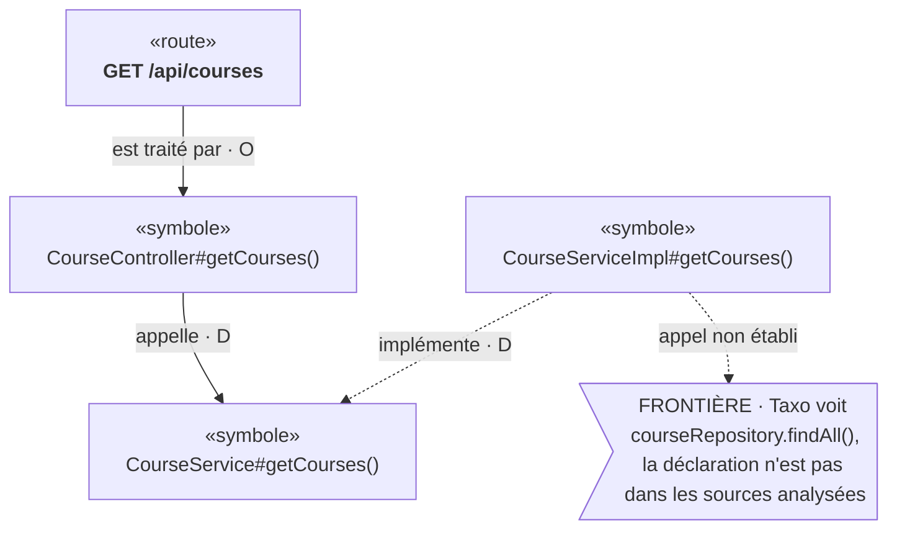

# TAXO-UI-06 — Vue Chaîne : lire une route en notation UML Taxo

Statut : **direction validée le 2026-10-06, récit à relire avant implémentation**.  
Date : 2026-10-06.  
Source de vérité : [ARCHITECTURE § 2, § 3 et § 9](../ARCHITECTURE.md), [TAXO-01J § 9](TAXO-01J-navigation-multiniveau-et-explorateur.md).  
Dépend de : explorateur de la Maille (TAXO-01J, livré). N'a d'intérêt complet qu'avec les appels Java
(TAXO-01K, proposition) : avant eux, la chaîne s'arrête au contrôleur.  
Ne dépend pas de Minia. Ne touche pas la MIP.

## Constat

La vue « Couches » de l'explorateur (`frontend/src/explorer/LayerView.tsx`, `layout.ts`) est fidèle mais
difficile à lire pour suivre une route :

- une flèche ne dit pas sa relation : il faut la choisir pour savoir si elle « appelle » ou « est protégée
  par » ;
- par défaut, jusqu'à seize relations sont suivies ensemble : sécurité, modules et appels se mélangent ;
- les colonnes rangent les nœuds par distance à l'ancre, pas dans le sens de lecture ; les courbes se
  croisent et les revisites reviennent en arc ;
- les noms sont coupés à la largeur de la boîte ;
- la frontière vit dans un panneau à part, loin de l'endroit du dessin où Taxo s'arrête.

## Intention

En tant que personne qui explore une route, je lis de haut en bas ce qui la traite, ce que cela appelle, et
où Taxo s'arrête, avec une notation inspirée d'UML : une boîte par nœud, une flèche nommée par relation,
la réalisation UML pour « implémente », une note UML pour la frontière.

Cible, sur `student-course-demo` une fois TAXO-01K livré :



La vue Chaîne est une **troisième forme** de l'explorateur, à côté de « Couches » et « Liste ». Elle ne
remplace ni ne retire rien. Elle dessine la Tuile déjà reçue : c'est une projection, jamais une seconde
source de vérité.

## Pourquoi pas un diagramme de séquence UML

Un diagramme de séquence affirme un ordre d'exécution et le corps qui s'exécute. Taxo ne le sait pas :
`CALLS` désigne une déclaration appelée, sans ordre ni dispatch, et `DISPATCHES_TO` est hors périmètre
(TAXO-01K, décisions 1 et 4). La vue Chaîne garde l'allure verticale qui rend la séquence lisible, sans
prétendre à un ordre ni à une exécution.

## Notation (normative pour ce récit)

| Élément | Dessin | Ce qu'il porte |
| --- | --- | --- |
| Nœud | boîte, en-tête avec le type entre « » (stéréotype UML) | le nom lisible de `naming()`, **en entier**, passé à la ligne, jamais coupé |
| Ancre | boîte au contour accentué, en haut | la référence choisie |
| Relation de chaîne | flèche pleine verticale, sujet au-dessus, objet en dessous | son verbe (`VERBS`), un badge de statut, `×N` s'il y a plusieurs occurrences |
| Relation de côté | flèche en pointillé à triangle creux (réalisation UML), horizontale | son verbe, son badge ; l'autre extrémité est posée dans la colonne de côté, sur la ligne du nœud qu'elle touche |
| Revisite | pastille « ↺ déjà montré : *nom* » sous le nœud | aucun arc de retour ; un clic choisit le nœud déjà dessiné |
| Frontière de connaissance locale | note UML (coin replié), ton d'avertissement, accrochée sous son nœud | la phrase de `knowledgeText`, la raison, l'accès à la preuve |
| Coupure de sélection | pastille grise sous son nœud | la phrase de `selectionText` et les actions existantes (développer, voir la suite) |

Badge de statut : **O** `OBSERVED`, **D** `INFERRED`, **V** `HUMAN_VALIDATED` ; un statut inconnu
s'affiche par son nom brut. Les frontières sans nœud (portée `ANALYSIS`) et les frontières de contexte
restent dans le panneau « Ce que la vue ne montre pas », inchangé.

Le sens d'une flèche est toujours celui du fait, sujet vers objet, comme dans la vue Couches.

## Exigences

### E1 — Forme des relations : une donnée du vocabulaire, pas une règle de l'explorateur

Le test d'architecture de l'explorateur interdit d'y nommer une relation ; il reste vrai. La forme de
chaque relation est une table du vocabulaire du portail (`frontend/src/vocabulary.ts`), à côté de
`VERBS` :

```text
FORMS : relation → CHAÎNE | CÔTÉ
HANDLED_BY → CHAÎNE, CALLS → CHAÎNE, IMPLEMENTS → CÔTÉ
```

Une relation absente de la table est de forme `CHAÎNE`. L'explorateur reçoit la table en entrée ; il ne
connaît aucune relation par son nom. Aucun mot Spring, contrôleur, service ou repository n'apparaît dans
la table, l'explorateur ou le moteur : ces mots ne viennent que des noms de classes du projet lu.

### E2 — Parcours « Appels depuis une route »

Un parcours prédéfini, déclaré dans le vocabulaire du portail, comme pas `(relation, sens)` :

```text
HANDLED_BY sortant, CALLS sortant, IMPLEMENTS entrant
```

Le moteur `neighborhood/2` accepte déjà `steps` (ARCHITECTURE § 9) ; seul `protocol.ts` apprend à les
envoyer, à côté de `follow` + `direction`. **Aucun changement du moteur, du protocole serveur ni de la
Maille.** Le parcours n'est proposé que si l'analyse annonce au moins une de ses relations
(`describe`) ; une relation sans producteur reste dite comme aujourd'hui (`NO_PRODUCER`).

Le parcours reste un réglage : la personne peut toujours choisir ses relations et son sens. La vue Chaîne
s'affiche pour tout réglage ; si un pas de chaîne est entrant, ses nœuds sont dessinés au-dessus du nœud
qu'ils touchent, toujours dans le sens du fait.

### E3 — Mise en page pure

Un module pur `frontend/src/explorer/chain.ts` (ni React, ni réseau, comme `layout.ts`) calcule la mise en
page depuis la vue, ses liens et la table des formes :

- la chaîne est l'arbre couvrant des liens `CHAÎNE` depuis l'ancre, chaque nœud posé à sa première
  découverte (`discovered_by`), une ligne par niveau de chaîne ;
- les frères sont rangés par première ligne de preuve quand la Tuile la porte, sinon dans l'ordre de la
  Tuile ; l'ordre est déterministe et n'affirme aucun ordre d'exécution ;
- un lien `CÔTÉ` pose son autre extrémité dans la colonne de côté, sur la ligne du nœud de chaîne qu'il
  touche ; si cette extrémité est déjà dessinée, c'est une revisite ;
- les tracés sont des segments droits ; aucun lien ne croise une boîte ;
- la hauteur d'une boîte suit la longueur de son nom, passé à la ligne après la ponctuation (`.`, `#`,
  `/`, `:`), sans découpage sémantique de la référence.

### E4 — La frontière dans le dessin

Une frontière de connaissance locale (`KNOWLEDGE`, portée `NODE`) devient une note accrochée sous son
nœud. Une coupure de sélection devient une pastille avec ses actions. Rien n'est dessiné pour combler une
frontière : un appel non établi s'arrête sur la note, aucune cible n'est devinée. La phrase de la raison
vient de `sentences.ts` ; les raisons fermées de TAXO-01K y reçoivent leur traduction avec la PR C de
TAXO-01K, pas ici.

### E5 — Interaction et accessibilité

Comme la vue Couches : nœuds, flèches, notes et pastilles sont de vrais boutons posés sur le tracé ; le
SVG ne fait que tracer. Choisir une flèche ouvre le panneau de preuves existant (`LinkPanel`) ; choisir
un nœud ouvre le panneau du nœud. Les libellés accessibles reprennent `factText` et les marques du nœud.
Lisible en thème clair et sombre.

### E6 — Export Mermaid

Un bouton « Copier en Mermaid » copie la chaîne affichée en texte `flowchart TD`, produit par une
fonction pure (`chain.ts` ou `mermaid.ts`) depuis la même mise en page : mêmes nœuds, mêmes verbes,
mêmes badges, mêmes notes. Les guillemets et chevrons des références sont échappés. L'export ne
contient que ce que la vue montre ; ses coupures y sont écrites.

## Tests

- `chain.test.ts`, sur des vues synthétiques écrites à la main : chaîne simple, deux frères, lien de
  côté, revisite sans arc, note de frontière locale, coupure de sélection, relation inconnue de forme
  `CHAÎNE`, pas de chaîne entrant, nom très long passé à la ligne.
- Export Mermaid : texte attendu écrit à la main, échappement des caractères spéciaux.
- `protocol.test.ts` : une demande par pas envoie `steps`, une demande sans pas reste inchangée à l'octet.
- `explorer.dom.test.tsx` : l'onglet « Chaîne » s'affiche, choisir une flèche ouvre la preuve, la
  pastille de coupure développe le nœud.
- `architecture.test.ts` inchangé et vert : aucune relation ni type nommé dans l'explorateur.

## Critères d'acceptation

1. Sur `student-course-demo`, la route `GET /api/courses` se lit de haut en bas dans l'onglet Chaîne,
   chaque flèche portant son verbe et son badge.
2. Avant TAXO-01K, la chaîne montre la route, le contrôleur, puis ce que Taxo ne sait pas : rien n'est
   inventé au-delà.
3. Après TAXO-01K, « implémente » est dessiné sur le côté et l'appel vers `findAll()` s'arrête sur une
   note de frontière lisible.
4. Les vues Couches et Liste sont inchangées.
5. Aucun changement du moteur de voisinage, du protocole serveur, du contrat des faits, de la Maille, de
   Minia ni de la MIP.
6. Tests frontend verts : `npm ci && npm test && npm run build`.

## Découpage proposé

- **PR 1 — Vue Chaîne.** Table des formes, `chain.ts`, onglet Chaîne, notes et pastilles, tests.
  Utilisable dès maintenant avec `HANDLED_BY`.
- **PR 2 — Parcours et export.** Envoi de `steps` par `protocol.ts`, parcours « Appels depuis une
  route », export Mermaid, essai sur `student-course-demo` après TAXO-01K avec une capture publiée dans
  ce récit.

## Hors périmètre

- Tout ordre d'exécution, diagramme de séquence ou `DISPATCHES_TO`.
- Un nom court de symbole fourni par le serveur (classe et méthode séparées) : il demanderait une
  donnée nouvelle portée par le producteur ; l'explorateur ne découpe jamais une référence lui-même. À
  proposer séparément si le nom complet passé à la ligne ne suffit pas.
- Toute relation propre à Spring ou JPA, tout rôle « contrôleur », « service » ou « repository ».
- La MIP, Minia, l'Arbre et la Forêt.

## Maquette

Maquette de la proposition (page privée du projet) :
<https://claude.ai/artifact/3Sh56uyqqsv18k3xmLARPF>
